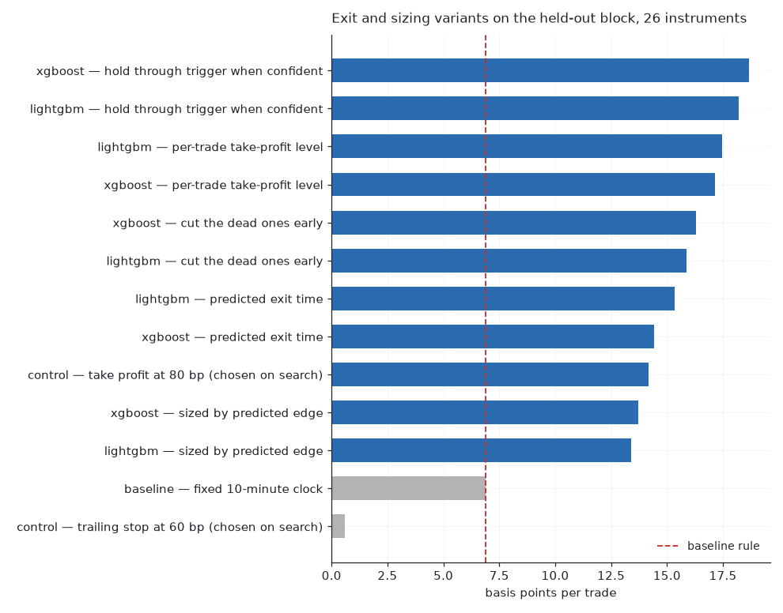
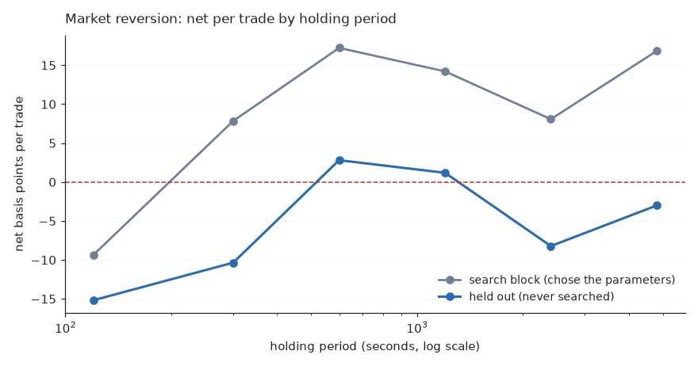
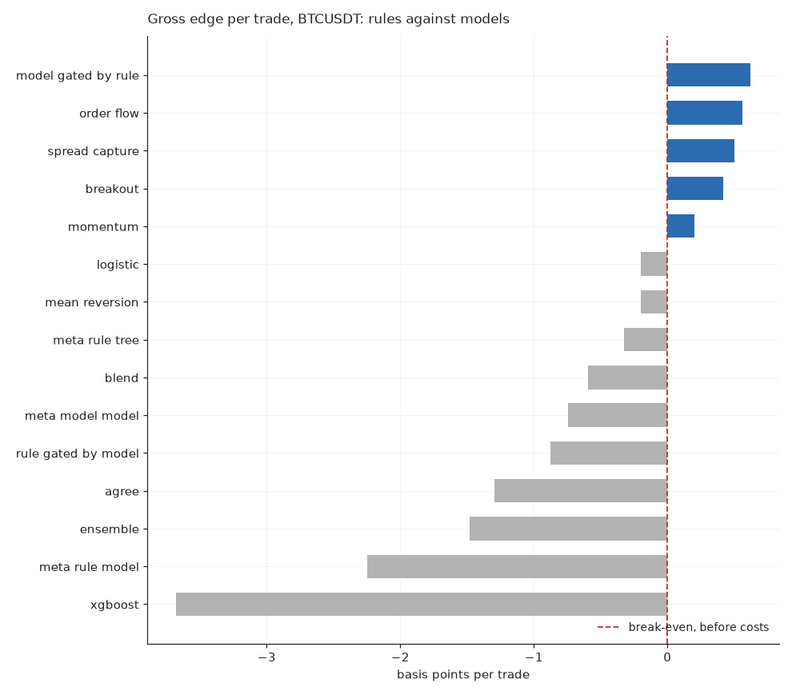
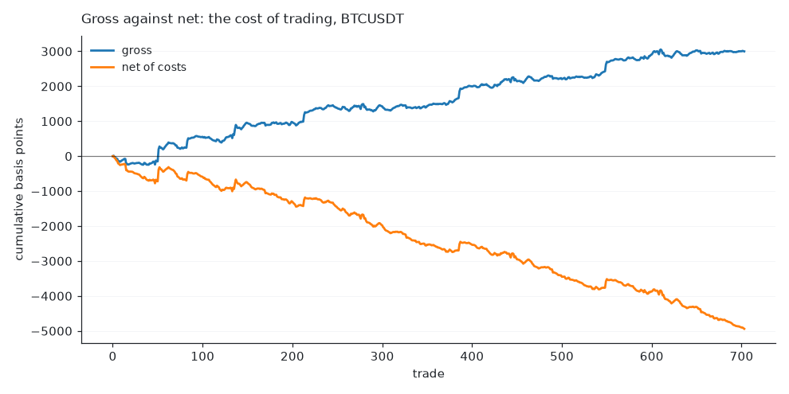
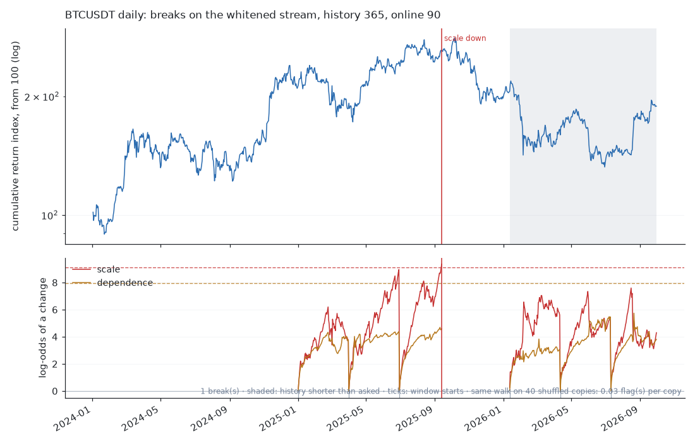

# trading-research-pipeline

**A leakage-aware research pipeline for systematic trading — and what it found
when pointed at crypto perpetuals.**

**The result.** Short-horizon cross-sectional reversion in crypto perpetuals
pays — under a market state that can be measured but, on the evidence here, not
forecast. On a held-out fortnight in the state that supports it, a
three-parameter rule earns **+6.99 bp per trade net of realistic costs on 22 of
26 instruments**, and a model that predicts how far each trade will run raises
that to **+18.8 bp over 3,297 trades**. On the six weeks that followed, where the
state was absent, the identical frozen configuration loses on all 26.

The state is one number: the index's ten-minute autocorrelation, −0.10 where the
strategy works and −0.0003 where it does not. The mechanism, the boundary, and
the three attempts to escape the boundary are in
[§27](docs/results.md#27-cross-sectional-reversion-and-the-market-state-it-requires).

Everything else here is negative and was established the same way. Directional
prediction from one instrument's own order book does not clear a taker round
trip: forty-four instruments screened, the three best searched over thirteen
axes, no winner profitable on a block that chose nothing.
[`docs/findings.md`](docs/findings.md) is the register — every candidate, its
status, and the condition written down before the test that would refute it.

Instruments, features, targets and models are compared under one honest cost
model, with look-ahead checked mechanically rather than promised.

It covers the whole path from raw events to a trading result: data contracts,
feature engineering, forward-looking labels, chronological validation with
purging and embargo, model comparison, and a backtest that charges realistic
transaction costs.

The emphasis is on the parts that decide whether a result means anything —
validation and cost accounting — rather than on the model. Most short-horizon
strategies that look profitable are not: they leak future information into
features, they tune on the data they report on, or they ignore what it costs to
cross a spread two hundred times a day. This project is built so that each of
those failure modes is a test that fails, not a caveat in a footnote.

> **Status: complete end to end, taker and maker.** Data contracts, a synthetic
> market, downloaders for two venues with data that fetches itself when missing,
> a feature registry with look-ahead checks, purged walk-forward splits, sixteen
> models from parameter-free rules to dilated convolutions, bagging, stacking on
> forward-chained out-of-fold predictions, a bias-variance decomposition that
> says which ensemble is worth using, calibration, cost-aware backtesting, a
> queue-level maker model, an event-time market-making simulator that fills only
> from trade prints, two regime-break detectors, an information audit that
> measures each data source before a model is chosen, successive-halving search
> over thirteen axes, and the experiment script behind every published table.
> 933 tests, a disclosure audit in CI.

---

## Why this project

Four things here are deliberately stricter than the norm in public trading
repositories:

**1. No look-ahead, checked mechanically.** Every feature registers the number
of observations it looks back. The test suite then mutates the data *after* a
cutoff and asserts that no feature value *before* the cutoff moved. That catches
centred rolling windows, backward fills and normalisation statistics fitted over
the whole sample — the three ways look-ahead usually gets in, none of which
makes anything visibly fail.

**2. Purging and embargo, derived rather than guessed.** A label at time *t*
reads prices up to *t + H*, so the tail of a training block overlaps the head of
the block after it. The split derives the embargo from the label's declared
horizon instead of leaving it to be set by hand, because an embargo set by hand
is usually set too small.

**3. Costs applied consistently.** The same cost model is used when labelling,
when deciding to trade, and when computing profit and loss. Backtests routinely
overstate results by labelling against a mid-price move that would not have
survived the spread.

**4. Findings are recorded with what would kill them, before the test.**
[`docs/findings.md`](docs/findings.md) lists every candidate this project has
produced with its status — candidate, confirmed, killed, artefact — and, for the
open ones, the condition that would refute them, written down in advance. Four
findings are in the killed column, each with the test that killed it. Two are
artefacts: an effect that turned out to be a property of the measurement rather
than the market.

That register exists because the same mistake kept recurring in different
costumes — a promising number, a plausible mechanism, and no test that could
have refuted it. Two rounds of adversarial review against this repository's own
code found nineteen defects, including a market gate that silently let
everything through while three searches reported a gate axis, and a test whose
name asserted the opposite of the behaviour it pinned. Both are documented where
they happened rather than quietly fixed.

The synthetic market underpins all of this. It contains a known, deliberately
weak predictable component, so the test suite can assert both directions: that
the pipeline finds the signal when there is one, and — with the signal switched
off — that it finds nothing. A pipeline that reports an edge on data with no
edge has a leak, and that is a test rather than a hope.

## The findings

One positive result with its domain of validity stated, and a broad negative
that motivated looking for it. In that order, because the second is what makes
the first worth having.

---

## The finding: reversion, and the state it needs

An equal-weighted index of twenty-six USDT perpetuals is computed, excluding the
instrument being traded. When the index has moved far over the last ten minutes,
take the opposite side in that instrument and close ten minutes later. No model,
three parameters.

### Where it pays

On a held-out fortnight — parameters chosen on the 26 days before it, the block
read once:

| | |
|---|---|
| Instruments positive | **22 of 26** |
| Median net per trade | **+6.99 bp** |
| Gross per trade | +20.50 bp |
| Cost per trade | 12–16 bp |

A model on top, predicting *how far each trade will run* and leaving the exit to
the rule, raises the pooled figure to **+18.8 bp per trade over 3,297 trades**,
paired *t* of 10.0, with two independent boosters agreeing to within 1.6 bp.
Asking the model *when to exit* instead fails on every architecture tried — that
distinction is the useful part of the exercise.

<picture>
  <source media="(prefers-color-scheme: dark)" srcset="docs/images/reversion_variants_ALL_dark.png">
  
</picture>

### The state it requires, measured

| | Where it works | Where it does not |
|---|---:|---:|
| **Index 10-minute autocorrelation** | **−0.1014** | **−0.0003** |
| Index move over the span | +49.8% | −33.1% |
| Dispersion of daily moves | 265 bp | 483 bp |

<picture>
  <source media="(prefers-color-scheme: dark)" srcset="docs/images/reversion_horizon_profile_dark.png">
  
</picture>

The holding-period profile is the mechanism made visible: two minutes loses, ten
is best, longer decays — the shape a reverting market produces and a trending one
does not.

### Why

A rising market's ten-minute surge is impatient buying that runs ahead of the
book, and it retraces; the strategy is paid for supplying the other side. A
falling market's ten-minute surge is forced flow — margin being closed — which
does not retrace, because the seller is not choosing and there is more behind.
The rule selects the *largest* ten-minute index moves, which in a cascade are
precisely the continuations. That predicts the sign of the failure, and gross
went from +20.50 to −5.07 rather than to zero.

### The boundary

Three attempts to escape the condition, all measured, all negative: daily
refitting of the threshold, daily re-estimation of the sign, and a gate that
trades only when trailing autocorrelation is low. The gate fails in the
informative direction — the days it admits are *worse* than the days it rejects,
in all four windows tried.

So: **the state is measurable, and on this evidence not forecastable a day
ahead.** The effect is real and conditional; deploying it needs a regime forecast
this project does not have. Anyone continuing should start there, not with the
trading rule, which is the easy half.

### And what fourteen days is worth

The +6.99 figure counts each trade as an observation, and 26 instruments carry
one market-wide bet — their per-day results correlate at +0.47. By day it is
+6.18 bp over 14 days, *t* = 1.18, 8 days positive. That establishes the effect
was present and how large; it does not establish persistence, which the six weeks
that followed then settled. Both statistics are computed for everything in this
repository by
[`evaluation/significance.py`](src/trading_research/evaluation/significance.py).

---

## What does not work: direction from one instrument's own book

Run first on Binance best-bid-ask for BTCUSDT and XRPUSDT in early 2024, and
then on Bybit's full order book for BTCUSDT (83 days) and BICOUSDT, CRVUSDT and
XRPUSDT (38 days each), the pipeline reaches a definite negative conclusion and
— more usefully — explains it.

Short-horizon direction **is** predictable. Queue imbalance correlates with the
next second's mid return at about 0.27, decaying to roughly 0.02 by ten
minutes. That is real signal, and it is reproducible.

It is also not enough. A taker round trip costs about 11 bp on Binance USD-M and
12–16 bp on Bybit, depending on the instrument's spread: a fee each side, plus
the spread, plus slippage. Against that, the best gross edge the corrected
searches produced is +3 to +9 bp per trade on the block that chose it — short by
a factor of two to four — and on the block that chose nothing, two of the three
winners have a gross edge of the wrong sign. No fold, on any instrument, at any
horizon tested, was profitable after costs.

The mechanism is visible in one table. Signal strength falls with horizon at
almost exactly the rate volatility rises, so their product — the expected gross
edge per trade — barely moves, while the fee stays fixed. **The horizon where
prediction works and the horizon where trading pays do not overlap.**

Every lever anyone reaches for was tested, and none of them helps. A longer
horizon does not, because within this range the edge is horizon-invariant. A
wider feature set — 194 generated columns against 10 hand-picked — measurably
made it worse. A better fee tier falls short by about a factor of five:
break-even needs roughly 0.3 bp per side against about 1.7 at the top volume
tiers, and even a zero fee leaves under a basis point per trade once the spread
is paid. A sequence model does not. Neither do bagging, random forests,
extremely randomised trees, a second booster, voting, or stacking — and the
[bias-variance decomposition](docs/results.md) says why: prediction variance is
negligible for all eight candidates, so there is nothing for averaging to
remove, and the models explain under 0.03% of the forward move.

Nor does *how* the strategy is run. Six exit rules, a market gate, four targets,
five rule-based strategies, a daily choice between them, retraining frequency,
refitting at detected regime breaks, and a full grid of training-window against
apply-window lengths — 672 cells of the last, of which three were positive, with
the two axes moving the median by 0.9 and 0.3 bp against a 13 bp cost.

And the learning is not what produces what edge there is. Trading the queue
imbalance directly — one feature, no model, no parameters — beats logistic
regression, gradient boosting and their ensemble on gross edge per trade, on
both instruments, through identical machinery. The models' extra apparatus
mostly buys selectivity, which the cost floor then eats.

<picture>
  <source media="(prefers-color-scheme: dark)" srcset="docs/images/strategies_btc_dark.png">
  
</picture>

Given five strategies and a daily choice between them — including the choice
not to trade — the selector stands aside on every single day it is offered
(§15). It is not a strategy that failed to find an edge; it is one that
identified in real time that there was none and acted accordingly. The
configurations that trade are the ones forbidden from declining, and they lose
around 2,600 bp of notional a day doing it.

One lever does move the number: **how often the model is retrained.** Fitting on
a fortnight and refitting every day — schedule chosen on validation, applied
once to test — raises XRP's gross edge to 12.31 bp against a 12.68 bp cost. That
is a shortfall of 0.37 bp rather than the ~10 bp gap everywhere else, and it is
still a loss: negative in sign, over 141 trades, with fewer than half its windows
positive. It is the closest this study gets, and close is not across.

<picture>
  <source media="(prefers-color-scheme: dark)" srcset="docs/images/bt_equity_dark.png">
  
</picture>

The whole study in one figure — the best BTCUSDT configuration's own trades,
rebuilt from the committed table by
[`scripts/render_readme_charts.py`](scripts/render_readme_charts.py): the
model's calls are right often enough for the gross line to climb three thousand
basis points, and the cost of crossing the spread takes the same trades eight
thousand the other way.

### Where the ceiling actually is

The audit in [§28](docs/results.md) measures each source of information before a
model is chosen, which is the order this project should have used from the
start. Fitting a model and looking at the money answers "did this arrangement
work" and never answers "was there anything here to find", so every negative
result before the audit was ambiguous.

At a two-minute horizon on BICOUSDT, the best single column of the touch
plane — the plane every earlier section used — reaches an information
coefficient of 0.022 out of sample. Break-even needs about **0.08 to 0.10**,
measured by blending predictions with the realised future at increasing weight
until profit crosses zero. The best of everything tried, over sixteen model
types, reaches 0.023.

So the ceiling was never the model, and no arrangement of trees, ensembles,
stacking or networks moves it. The bias-variance decomposition says why:
prediction variance is negligible, so averaging has nothing to remove, and the
models explain under 0.03% of the forward move.

The cross-sectional column that reached 0.046 — twice the best own-book
feature — is what sent this project after the reversion candidate above. That
0.046 was real on the span it was measured on, and the six weeks that followed
say it was a property of those weeks.

See [`docs/results.md`](docs/results.md) for the full picture,
[`docs/findings.md`](docs/findings.md) for the register of every candidate and
its status, and [`docs/limitations.md`](docs/limitations.md) for what none of it
establishes. No backtest here should be read as evidence that any strategy is or
was profitable.

---

## Market making: quoting both sides on public Bybit data

A study in progress, and nothing in this section is a result yet: no quoter has
been run on any block.

**What was pre-registered.** Before any market-making code existed,
[`docs/preregistration/market_making.md`](docs/preregistration/market_making.md)
and [`configs/mm_prereg.yaml`](configs/mm_prereg.yaml) (commit `cb4ae4c`) fixed
the blocks, the instrument admission rule, three hypotheses with their kill
conditions and placebos, and the rule that the held-out fortnight is read once
(corrections to the simulator found in code review, before any result, are
recorded there as Amendment 1). The hypotheses:

- **H1** — quoting one tick inside a wide spread, first in the queue, earns more
  than the same quoter at the touch;
- **H2** — the reversion state of [§27](docs/results.md#27-cross-sectional-reversion-and-the-market-state-it-requires)
  pays a market maker that leans against the index's move (H2.1), and passive
  execution of the frozen reversion signal beats crossing for it (H2.2);
- **H3** — pulling or widening quotes after a regime-break flag earns more than
  quoting through it.

**The simulator, in six rules.** Built first, tested on synthetic markets with
known answers, and documented rule by rule with the direction each one biases a
result in [`docs/market_making_simulator.md`](docs/market_making_simulator.md):

1. **Fills only from prints.** A resting order fills only when a print reaches
   its price from the side that hits it, never because a snapshot moved.
2. **A queue per order.** It joins the tail of the visible size, moves up only
   as prints consume what is ahead, and gains on cancellations by a rule that is
   bracketed — and a verdict must survive the pessimistic bracket.
3. **Latency.** Orders, cancels and flattens take 10 ms; a cancel in flight
   does not protect the order; a price change loses priority.
4. **Own size and limits.** A tenth of the touch at most; soft and hard
   inventory limits; past the soft limit a reduce-only taker order flattens
   back, walking the first book after it arrives.
5. **Fees and funding.** Maker fee on passive fills, taker fee on flattens,
   funding on the position held at each settlement; days start and end flat.
6. **What it does not model.** The book is a 100 ms photograph, so queue
   dynamics inside 100 ms are a stated rule rather than an observation; own
   impact on others is ignored; a snapshot that crosses an order fills nothing
   without a print, which is optimistic and is bracketed. A day whose stored
   book lost messages, or whose flatten found no fresh book, is flagged and
   kept out of every verdict.

The quoters, the development-period search and the single read of the held-out
fortnight follow, in that order.

---

## The pipeline, step by step

Twelve steps from "which market" to "running in production". Eleven are built;
the last is marked and is not.

```
 ┌── 0 ──────────┐   ┌── 1 ──────────┐   ┌── 2 ──────────┐   ┌── 3 ──────────┐
 │ screen        │   │ get the data  │   │ build         │   │ label what    │
 │ instruments   │──▶│ + contracts   │──▶│ features      │──▶│ counts as a   │
 │ by headroom   │   │ + validation  │   │ (declared     │   │ move worth    │
 │               │   │               │   │  lookback)    │   │ trading       │
 └───────────────┘   └───────────────┘   └───────────────┘   └───────────────┘
                                                                     │
 ┌── 7 ──────────┐   ┌── 6 ──────────┐   ┌── 5 ──────────┐   ┌── 4 ──▼───────┐
 │ decide how to │   │ decide when   │   │ fit + choose  │   │ split in time │
 │ leave         │◀──│ to enter      │◀──│ the model     │◀──│ purge+embargo │
 │               │   │ (threshold)   │   │               │   │               │
 └───────────────┘   └───────────────┘   └───────────────┘   └───────────────┘
         │
 ┌── 8 ──▼───────┐   ┌── 9 ──────────┐   ┌── 10 ─────────┐   ┌── 11 ─────────┐
 │ charge the    │   │ search the    │   │ review it     │   │ deploy + run  │
 │ costs         │──▶│ configuration │──▶│ against a     │──▶│   ⚠ not built │
 │               │   │ (smart, not   │   │ strict rubric │   │               │
 └───────────────┘   │  exhaustive)  │   └───────────────┘   └───────────────┘
                     └───────────────┘
```

**0. Choose the instrument.** `trading-research discover` enumerates what the
venue lists; `trading-research screen` ranks it on both halves of the edge
identity — how far the price moves against the cost, *and* whether the book
predicts where. Three days of data per instrument.

Both halves matter and the first version had only one. Ranked on movement alone
it put XMRUSDT third of forty-four; XMRUSDT moves nine times as far as BTCUSDT
and its book predicts nothing (correlation 0.0002 against 0.049), and the full
pipeline run on it did worse than on the instrument it was meant to replace.
Corrected, the ranking inverts.

The screen has itself been corrected twice, and both corrections are in
[§20](docs/results.md). It measured the dispersion of the *absolute* move where
the identity needs the signed one, understating every edge by about forty per
cent; and "edge is bounded by IC × dispersion" was used as an impossibility
argument when it bounds the *average* trade rather than a selective one. With
both fixed: **the best of forty-four instruments has an average edge about a
tenth of its cost, and BTCUSDT — the instrument most of this project was built
on — has a thirtieth.** That three-fold gap is larger than anything the
modelling ever moved, which is why the instrument is chosen before the model
and not after.

The screen is also the one step here with a stability check. Re-run on Bybit
across eighty instruments over two windows seven weeks apart, the rank
correlation of edge-over-cost is 0.59 — so it measures a real property, not
noise. But half the top ten changes between windows, so it supports taking a
basket of five to ten rather than trusting a single best instrument.

*Choosing the model class is still a judgement made by hand.*

**1. Get the data, under a contract.** `trading-research download` pulls
Binance public archives, verifies checksums, and converts to a declared schema.
Two planes are modelled separately — trades and book — because a full order book
cannot be reconstructed from a trade tape. `validate-data` checks the contract
and reports gaps, crossed books and clock problems as findings rather than
crashes.

**2. Build features.** Every feature is a pure function that declares how far
back it looks. The test suite mutates data *after* a cutoff and asserts nothing
before the cutoff moved, which catches centred windows, backward fills and
whole-sample normalisation — the three ways look-ahead usually gets in.

**3. Label what counts as a move worth trading.** A forward return larger than
the round-trip cost is a BUY or a SELL; everything else is HOLD. The threshold
is the cost, so the model is learning to spot moves that could actually pay,
not moves that merely happen.

**4. Split in time.** Walk-forward over whole days, with the embargo derived
from the label's horizon rather than guessed. A label at *t* reads prices to
*t+H*, so the tail of every training block is dropped.

**Regime monitoring.** A model fitted on one stretch of market is expected to
apply until the market changes, and a fixed retraining cadence is a guess about
when that is. Two detectors say instead when the data changed. The first
([`validation/changepoint.py`](src/trading_research/validation/changepoint.py))
reads book statistics in non-overlapping blocks at tick frequency. The second
([`validation/structural_breaks.py`](src/trading_research/validation/structural_breaks.py))
comes from [adia-structural-break](https://github.com/bamasa/adia-structural-break),
the author's solution to the ADIA Lab Structural Break Challenge, Real-Time
Edition (CrunchDAO, 2026; 0.6299 TS-AUC at the close of submissions, about rank 160
of 1,716 registered participants on the public leaderboard),
installed as a dependency rather than copied: the return series is whitened by
its own history — an AR(p) fit by BIC, a conditional scale and the empirical
distribution of the innovations — and every test runs on the whitened stream,
with Shiryaev-Roberts odds of a change read per family (scale, dependence,
mean). Thresholds are calibrated against a null, not chosen by eye; the figure
below is BTCUSDT daily from January 2024, with the breaks the monitor flags, the
odds behind them, and the window resets that keep the odds from accumulating
forever. `uv sync --extra breaks`, then
`trading-research breaks --symbol BTCUSDT --interval 1d --start 2024-01-01 --end 2026-09-30 --plot`.

<picture>
  <source media="(prefers-color-scheme: dark)" srcset="docs/images/structural_breaks_BTCUSDT_dark.png">
  
</picture>

On 1,003 daily returns the walk opens six windows and flags one break: **13
September 2025, scale, downward** — the odds of a fall in variance cleared the
calibrated threshold (9.36 against 9.09) seventy-five days into the window that
opened on 30 June, after a near miss on 29 June (8.96). Monitoring then paused
until the re-anchored history reached a third of a year, which is the shaded
stretch. The same walk over forty shuffled copies of the returns — the same
marginal distribution, no regime — flags one copy, so the null reading is one
flag in forty against one on the real series; the shorter-memory setting
(history 250, online 60) flags two scale breaks, 6 February 2026 up and 14
August 2026 down, at six flags in forty on its null, and is reported beside
it in [`experiments/results/`](experiments/results/structural_breaks_BTCUSDT_breaks.csv)
rather than preferred. No dependence break is flagged on this series at either
setting.

What the figure does not claim: that refitting at these breaks would have
improved any trading result. That comparison belongs to the refit-policy axis of
`grand_search.py` and is listed under the roadmap.

**5. Fit and choose the model.** Rule-based strategies (momentum, mean
reversion, order-flow, breakout) run through the identical machinery as the
learned ones (logistic, gradient boosting, a dilated causal network) and their
ensembles. A comparison where the baseline is scored differently is not a
comparison.

**6. Decide when to enter.** One threshold on the model's confidence, swept on
validation. Raising it trades less and more selectively; the sweep can optimise
either total profit or profit per trade, and the second is what "trade only the
best signals" means when the cut is made honestly.

**7. Decide how to leave.** Six rules: a fixed clock, take-profit, stop-loss,
trailing stop, and two that read the model's ongoing opinion — leave when its
confidence decays, or when its prediction flips. Plus a market gate that
declines to trade at all when volatility cannot support the cost.

**8. Charge the costs.** The same cost model at labelling, at the decision, and
in the profit and loss. Taker on both legs: fee, spread, slippage.

**9. Search the configuration.** Successive halving over sampled configurations
rather than a nested product — cheap candidates are killed after a few windows
and only survivors are measured on the full span. Everything is chosen on
validation and the test span is scored once.

**10. Review it.** `trading-research review` assembles the arithmetic half of
[`docs/evaluation/rubric.md`](docs/evaluation/rubric.md) — result, dispersion,
drawdown, and how many trades the edge would need to be established — into a
document a reviewer or an agent can read.
[`docs/evaluation/prompt.md`](docs/evaluation/prompt.md) is the reviewer's
instructions. The tool scores nothing: something that produced the evidence and
graded it would be marking its own work.

This project's own scorecard is in
[`docs/evaluation/btc_best.md`](docs/evaluation/btc_best.md), and it is not
flattering.

**11. Deploy and run.** ⚠ *Not built.* What is missing is not the model but
everything around it: a live data feed with gap recovery, the feature pipeline
running in streaming rather than batch, an order router, position and risk
limits, a kill switch, and monitoring that compares live fills against what the
backtest assumed. That last one is the point — a strategy that silently decays
looks identical to one that is working until it does not.

---

## Architecture

```
        data                features            labels           validation
   ┌──────────────┐   ┌──────────────────┐  ┌─────────────┐  ┌────────────────┐
   │ trade events │──▶│ registry of pure │─▶│ forward     │─▶│ chronological  │
   │ book snaps   │   │ functions, each  │  │ returns,    │  │ splits, purge  │
   │ + contracts  │   │ declaring its    │  │ declaring   │  │ + embargo from │
   │ + validation │   │ lookback         │  │ its horizon │  │ label horizon  │
   └──────────────┘   └──────────────────┘  └─────────────┘  └────────────────┘
          │                                                          │
          │                                                          ▼
          │                             models              ┌────────────────┐
          │                    ┌──────────────────────┐     │ walk-forward   │
          └───────────────────▶│ naive · logistic ·   │◀────│ evaluation     │
                               │ xgboost · sequence   │     └────────────────┘
                               └──────────────────────┘
                                          │
                                          ▼
                              backtest              reporting
                        ┌────────────────────┐  ┌──────────────────┐
                        │ costs in bp,       │─▶│ manifest, plots, │
                        │ spread crossing,   │  │ cost attribution │
                        │ slippage, fills    │  │ regime breakdown │
                        └────────────────────┘  └──────────────────┘
```

Two data planes are modelled separately, because they have different
availability:

| Plane | Contents | Real data |
|---|---|---|
| **trades** | one row per trade or aggregated trade | public exchange archives |
| **book** | one row per snapshot, *N* levels per side | requires a dedicated collector |

A full order book cannot be reconstructed from public trade archives — the
resting size that was never hit leaves no trace in the trade tape. The book
plane is therefore defined and exercised against synthetic data from the start,
so that book features and their tests exist before the collector does.

---

## Quickstart

Requires Python 3.11+ and [uv](https://docs.astral.sh/uv/).

```bash
git clone https://github.com/bamasa/trading-research-pipeline
cd trading-research-pipeline
uv sync --all-extras
```

Generate a synthetic dataset and check it:

```bash
uv run trading-research generate-demo-data --output data/demo
uv run trading-research validate-data --input data/demo
uv run pytest
```

Inspect a data contract:

```bash
uv run trading-research describe-schema book
```

Nothing here downloads anything or needs credentials.

### Reproducing the finding, one command

```bash
uv run trading-research reproduce
```

runs every stage in order on a clean checkout: fetches what is missing, audits
which family of signal carries anything, searches the configuration on the
search block — taking the best *neighbourhood* rather than the best cell, with
the peak it declined reported beside the choice — reads the held-out block once
with thresholds carried over, and prints the result with both statistics and the
market state it depends on.

Two honesty properties are worth knowing before reading its output. The held-out
block is read once; if the numbers disappoint, that is the answer, and the run
does not go back. And the printed verdict comes from the clustered statistic,
which counts days rather than trades — on the spans in this repository the two
differ by a factor of five.

Run on the spans the documents use, the pipeline's own end-to-end choice lands
one cell away from §27's configuration and loses on the held-out block — which
is reported here rather than smoothed over, because it is a fair measure of how
sharp the effect's edge is: one neighbouring cell, and it is gone.

### The pipeline on real data

Five stages, each a command, each writing files and a manifest. Download once,
then run the rest as often as needed:

```bash
# once: public archives, checksum-verified, never committed
uv run trading-research download --symbol BTCUSDT --kind bookTicker \
    --start 2024-02-01 --end 2024-03-09 --grid 100ms
uv run trading-research download --symbol BTCUSDT --kind aggTrades \
    --start 2024-02-01 --end 2024-03-09

# features, one file per day
uv run trading-research prepare --symbol BTCUSDT --horizon 1200 --subsample 50

# everything below reads only the window it is given
uv run trading-research select --train-start 2024-02-01 --train-end 2024-02-14
uv run trading-research train  --train-start 2024-02-01 --train-end 2024-02-14 \
    --model logistic
uv run trading-research predict --start 2024-02-22 --end 2024-02-28
uv run trading-research backtest --min-confidence 0.62 --hold 24 --cooldown 120

# how often to retrain: window length, apply length and step, searched on the
# first half of the span and applied once to the second
uv run trading-research retrain-search --model logistic --start 2024-02-15 \
    --train-days 3,7,14,21 --apply-days 1,3,7

# how to leave a trade: clock, take-profit, stop, trail, or the model's own
# fading opinion — chosen on validation, applied once to test
uv run trading-research exit-search --model logistic --hold 24
```

The model is one flag — `--model logistic | xgboost | tcn` — and so are the
instrument, the horizon and the feature set, so comparing combinations is the
normal case rather than a special one.

Run each model in its own invocation rather than looping inside one process:
XGBoost and PyTorch each bundle an OpenMP runtime and deadlock together on
macOS. The staged layout avoids this by construction.

`make help` lists the common tasks.

---

## Data

**Synthetic (default).** A generated market with volatility regimes, a
liquidity state, a spread that widens under stress, geometric depth decay, and
Poisson trade arrivals that execute against the book. It exists for tests, CI
and the quickstart. It is *not* evidence about markets: every row is stamped
`source="synthetic"` and every artefact carries a warning, because a synthetic
backtest measures the agreement between a generator and a model and nothing
else.

**Public exchange data.** Two venues, for two different things.

*Binance* publishes best bid and ask, aggregated trades, open interest and
funding as daily archives, and bars (`klines`) at every interval as monthly
ones. Used for the instrument screen, which needs breadth rather than depth,
and — the bars — for regime monitoring, which needs years rather than days.
Note that daily `bookTicker` archives stop after 30 March 2024, which is why the
screen can be measured on two windows and not more.

*Bybit* publishes the **full order book** as an incremental stream — a snapshot
and its deltas — which reconstructs to ten levels a side, and publishes trade
prints carrying the aggressor's side. Everything from §24 onward runs on these:
the depth features need the levels, and the maker model needs the prints,
because a book says what was offered and only a print says what was taken.

**Nothing under `data/` is in version control.** A day of one instrument's book
is hundreds of megabytes.

**The code fetches what it needs.** Every experiment declares its instruments
and span, and [`data/ensure.py`](src/trading_research/data/ensure.py) compares
that against what is on disk and downloads only the gaps. A clean checkout
therefore runs — slowly the first time, instantly afterwards. Three properties
are deliberate:

- an interrupted run resumes rather than restarts, since a day already present
  is never fetched twice;
- a day the venue does not have is reported and skipped, not raised — an
  instrument listed mid-span has no archive before it existed — while a *total*
  absence does raise, so an experiment cannot quietly run on nothing;
- nothing downloads silently: each call prints what it will fetch first, and
  `dry_run=True` answers the question without acting.

```python
from datetime import date
from trading_research.data.ensure import ensure_bars, ensure_book, ensure_universe

# ten levels a side, about two minutes of replay per day
ensure_book("DOGEUSDT", date(2024, 2, 1), date(2024, 3, 10))

# top of book only for a cross-section: eleven seconds per instrument-day
ensure_universe(["BTCUSDT", "ETHUSDT"], date(2024, 2, 1), date(2024, 3, 10))

# daily bars for regime monitoring: a few kilobytes a month
ensure_bars("BTCUSDT", "1d", date(2024, 1, 1), date(2026, 9, 30))
```

The venue rate-limits sustained downloading. A stalled fetch is the venue, not
the code; wait and re-run, and it resumes from where it stopped.

**Synthetic data** remains the default for tests and the quickstart, so neither
needs the network.

---

## Methodology

Documented in [`docs/`](docs/) as it lands:

| Document | Contents |
|---|---|
| `data_contract.md` | Column semantics, units, time conventions, quality rules |
| `methodology.md` | Features, labels, splits, model comparison protocol |
| [`execution_assumptions.md`](docs/execution_assumptions.md) | Cost model, fills, what each execution mode (taker, passive entry, market maker) does and does not simulate |
| [`market_making_simulator.md`](docs/market_making_simulator.md) | The event-time market-making simulator: every rule, the direction of its bias, and the test that pins it |
| `limitations.md` | What this does not establish |
| `disclosure_policy.md` | What is public here and why, and what is not |
| `preregistration/market_making.md` | The market-making study, registered before any code or number: blocks, hypotheses, kill conditions, placebos, amendment protocol |

---

## Limitations

Stated plainly, because the honest version is more useful than the flattering
one:

- **No profitability claim is made.** No result in this repository should be
  read as evidence that any strategy is or was profitable.
- **Synthetic results are circular.** They demonstrate that the pipeline works,
  not that markets behave this way.
- **The backtest is a simulation.** The taker backtest does not model queue
  position, partial fills against a real book, latency, market impact, or the
  fact that a real order changes the book it is trading against. The
  market-making simulator models queue position, partial fills and latency, but
  from a 100 ms book rather than a message feed, with cancellations attributed
  by rule, own impact ignored, and a crossed snapshot filling nothing without a
  print — each stated with its direction in
  [`docs/market_making_simulator.md`](docs/market_making_simulator.md).
- **Public data is coarser than production data.** Exchange archives are
  aggregated; a real system runs on a live feed with different timing.
- **Short horizons are the hardest regime for this.** Costs dominate, edges are
  thin, and results are unstable across periods. Where that shows up, it is
  reported rather than tuned away.

---

## Reproducibility

- One seed per run, recorded in the run manifest along with the full
  configuration and the schema version.
- Datasets are directories with a `manifest.json` describing provenance — for
  synthetic data, the generator version and seed that produced it.
- Every assumption that moves a number lives in the config file, not in a
  default buried in a function.
- CI runs lint, types, tests, the end-to-end demo, and a disclosure audit that
  scans for private paths, credential-shaped strings, notebook outputs and
  oversized binaries.

---

## Roadmap

Done:

- [x] Package skeleton, tooling, CI, disclosure audit
- [x] Data contracts for both planes, with quality validation
- [x] Synthetic market with regimes and a known injected signal
- [x] Binance public-data downloader with checksums and manifests
- [x] Feature registry with declared lookbacks and automated look-ahead tests
- [x] Directional labels and purged walk-forward splits
- [x] Naive, logistic and gradient-boosted baselines
- [x] Taker cost model and execution-aware evaluation
- [x] Wide generated feature set with train-only selection
- [x] Horizon diagnostics: predictability against tradeability
- [x] BTC → XRP transfer experiment
- [x] Staged pipeline: `prepare`, `select`, `train`, `predict`, `backtest`
- [x] Sequence model (dilated causal convolutions), compared against the rest
- [x] Trade thinning with cooldown, take-profit and stop-loss
- [x] Isotonic and Platt calibration
- [x] Retraining schedule as a searched parameter, not an assumption
- [x] Experiment scripts behind every published table
- [x] Six exit rules, with the policy searched on validation
- [x] Rule-based strategies — momentum, mean reversion, order flow, breakout —
      scored through the same machinery as the learned ones
- [x] Model ensembles, and a market gate that declines to trade in conditions
      that cannot support the cost
- [x] Successive halving over sampled configurations, in place of a grid
- [x] Rolling normalisation of features against a trailing window
- [x] Pooling instruments into one training set — **tried and rejected**: every
      instrument did worse on the pool than on itself (§22), and the scope is
      deliberately one instrument at a time from here
- [x] Instrument screening by headroom, before anything is fitted — **and the
      correction that followed**: the screen measured the dispersion of the
      *absolute* move where the identity needs the signed one, understating
      every edge by about forty per cent (§20)
- [x] A review rubric and an evidence pack for it, applied to this project's
      own result
- [x] **Step 0 automated.** A screen over eighty instruments on the venue that
      is actually traded, measured on two windows seven weeks apart. Rank
      correlation 0.59, so it measures a real property — but half the top ten
      changes between windows, so it supports a basket of five to ten rather
      than a single best instrument
- [x] Multi-level order books reconstructed from Bybit's incremental stream,
      ten levels a side, with sequence-gap detection
- [x] Trade prints with the aggressor's side — what a book cannot say, and what
      a maker model needs
- [x] **A queue-level maker model**: an order joins behind the size resting at
      its price and fills only once that much opposing volume has traded
      through. Measures adverse selection rather than assuming a figure for it
- [x] Regime-break detection: a CUSUM over four block statistics of the book at
      tick frequency, with its threshold calibrated against forty synthetic
      nulls rather than by eye
- [x] Regime monitoring on the whitened stream, from the ADIA structural-break
      solution, as a dependency: scale, dependence and mean breaks on any
      return series, thresholds calibrated against Gaussian nulls, the history
      re-anchored at each break
- [x] Randomised tree ensembles, a second booster, bagging over stretches of
      history, voting with a diversity figure, and stacking on forward-chained
      out-of-fold predictions
- [x] **A bias-variance decomposition** that says which ensemble is worth using,
      resampling contiguous history rather than random rows — on this data it
      says none of them are, because the variance to average away is not there
- [x] **An information audit**: each data source measured before a model is
      chosen, for what it reaches alone and what it adds on top of the sources
      already accepted. This is what found the cross-sectional signal
- [x] Cross-instrument features — leader and index returns, catch-up, beta,
      dispersion, rank — the omission that had no good excuse
- [x] Order-flow features from trade prints, alongside the queue features
- [x] Position sizing rules: volatility targeting, a confidence ramp, fractional
      Kelly — documented with the identity that sizing is multiplicative in the
      edge and cannot turn a losing one positive
- [x] Pairs trading: hedge ratio, Ornstein-Uhlenbeck residual, half-life
- [x] Data that fetches itself when it is missing, so a clean checkout runs
- [x] A findings register with each candidate's status and the conditions that
      would kill it, written before the test rather than after

Next, and in this order, because the first one decides whether the rest matters:

- [ ] **The decisive test.** The frozen reversion configuration on days neither
      block has seen. Four earlier findings in this project looked at least as
      good and did not survive it. The span could not be fetched because the
      venue began rate-limiting sustained downloads; this is a matter of waiting,
      not of code.
- [ ] **A mechanism for the reversion.** Correlation without a cause is what
      falls over. Liquidation cascades, funding settlement and session
      boundaries are each testable, and an effect that concentrates in explicable
      windows is worth more than one spread evenly.
- [ ] **The maker case for this signal specifically.** Adverse selection was
      measured unconditionally and costs about what the fee saving is worth. But
      a reversion strategy *wants* to be filled against the move, which is
      exactly when a resting order fills — so the thing that killed passive
      execution everywhere else may work in its favour here.
- [ ] A volume-weighted index rather than an equal-weighted one, and the same
      question asked of order flow rather than price
- [ ] Refitting at the breaks the whitened monitor flags, against the fixed
      cadences of §10, on the refit-policy axis `grand_search.py` already has
- [ ] Unified report: calibration, equity, drawdown, cost attribution, regimes

**Market making, registered before it is built.** The maker case above is one
of three hypotheses in a market-making study: a two-sided quoter with inventory
limits, simulated in event time with a queue per order and fills only from
Bybit's trade prints. The blocks, the instrument admission rule, the hypotheses
with their kill conditions and placebos, the advantage ladder, the fee
break-even and the amendment protocol are in
[`docs/preregistration/market_making.md`](docs/preregistration/market_making.md),
with the values the code will read in
[`configs/mm_prereg.yaml`](configs/mm_prereg.yaml). Both were committed before
any simulator code existed and before any market-making number was computed on
any block.

- [x] **The event-time simulator**: fills only from prints, a queue per order
      with bracketed cancellation rules, latency, post-only, inventory limits,
      fees, funding and an accounting identity checked at every change, tested
      on known-answer markets ([rules](docs/market_making_simulator.md))
- [ ] The quoters, the regime flags and the development-period search, with
      the pre-registration's single amendment
- [ ] The held-out fortnight, read once

**Step 10: deployment.** Nothing here runs live, and the gap is not the model:

- [ ] Live feed with sequence-gap recovery and a reconnect that does not silently
      skip data
- [ ] Features computed in streaming rather than batch, producing bit-identical
      values to the research path — a discrepancy here is the classic way a
      backtest and a live system quietly diverge
- [ ] Order router, position limits, risk limits, kill switch
- [ ] Monitoring that compares live fills against what the backtest assumed:
      realised spread, slippage, fill rate. A strategy that is decaying looks
      exactly like one that is working until it does not

Maker execution — built, and it does not pay
--------------------------------------------
An early section estimated what posting would be worth by assuming a figure for
adverse selection. That estimate was replaced by a measurement, and the
measurement disagreed with it.

[`backtest/maker.py`](src/trading_research/backtest/maker.py) simulates the
mechanism: an order joins the queue behind the size resting at its price and
fills only once that much opposing volume has traded through, using Bybit's
trade prints for the flow. Costs fall exactly as the arithmetic promised, from
14–16 bp to 5.9–7.1 with a passive exit. **The gross edge inverts**: the same
signal at the same moments is worth +3 to +8 bp crossing and −0.5 to −4.2 bp
resting. Adverse selection is 5–11 bp — the same size as the fee saving. Zero of
48 configurations positive on net or on gross.

The mechanism shows in the detail: joining the touch is *worse* than posting
behind it, because filling faster means filling when the market is moving
against you, while the favourable moves leave the order unfilled.

Three optimisms remain, stated in the module rather than buried: the queue ahead
never grows, cancellations ahead are ignored, and the order's own size is
treated as negligible. All three flatter the passive strategy, and it loses
anyway.

What is left to do here:

- [ ] The conditional version of the same measurement for the reversion signal,
      where being filled against the move may be an advantage rather than the
      usual tax — see the roadmap item above.
- [ ] Capacity. A fill rate in the teens turns a strategy that took 3,297 trades
      into one that takes a few hundred, which establishes much less.

## Relationship to prior closed-source work

The author has worked on short-horizon prediction for order-book data in a
commercial setting. This repository shares none of that code, data,
configuration or results. It is an independent implementation, written from
scratch, using public and generated data only, and it deliberately diverges
where the public version can be stricter — the purging, embargo and automated
look-ahead checks described above are additions, not reproductions.

See [`docs/disclosure_policy.md`](docs/disclosure_policy.md).

---

## Disclaimer

This is research and engineering code published as a portfolio and a teaching
artefact. It is **not** investment advice, **not** a trading system, and
**not** a claim about future returns. Backtested results — including any shown
here — are computed with the benefit of hindsight under stated assumptions, and
do not establish that a strategy would have been profitable in live trading or
would be profitable in future.

## License

[MIT](LICENSE).
