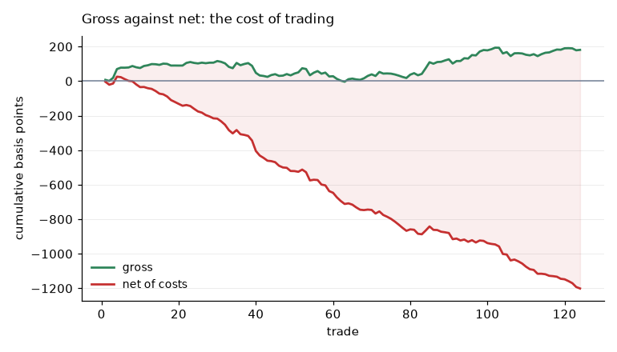
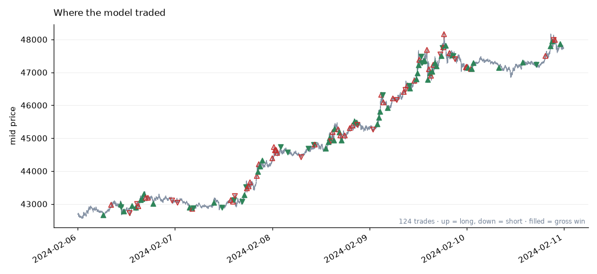

# trading-research-pipeline

**A leakage-aware research pipeline for systematic trading.**

Instruments, features, targets and models are compared under one honest cost
model, with look-ahead checked mechanically rather than promised. Demonstrated
end to end on crypto limit-order-book data; the pipeline itself is not tied to
that example.

It covers the whole path from raw events to a trading result: data contracts,
feature engineering, forward-looking labels, chronological validation with
purging and embargo, model comparison, and a backtest that charges realistic
transaction costs.

The emphasis is on the parts that decide whether a result means anything —
validation and cost accounting — rather than on the model. Most short-horizon
strategies that look profitable are not: they leak future information into
features, they tune on the data they report on, or they ignore what it costs to
cross a spread two hundred times a day. This project is built so that each of
those failure modes is a test that fails, not a caveat in a footnote.

> **Status: complete end to end, taker execution only.** Data contracts,
> synthetic market, downloader, feature registry with look-ahead checks, purged
> walk-forward splits, five models, calibration, cost-aware backtesting, a
> searched retraining schedule, and the experiment scripts behind every
> published table. Maker execution is measured as a bound in
> [§11](docs/results.md) and deliberately not built on — see the
> [roadmap](#roadmap).

---

## Why this project

Three things here are deliberately stricter than the norm in public trading
repositories:

**1. No look-ahead, checked mechanically.** Every feature registers the number
of observations it looks back. The test suite then mutates the data *after* a
cutoff and asserts that no feature value *before* the cutoff moved. That catches
centred rolling windows, backward fills and normalisation statistics fitted over
the whole sample — the three ways look-ahead usually gets in, none of which
makes anything visibly fail.

**2. Purging and embargo, derived rather than guessed.** A label at time *t*
reads prices up to *t + H*, so the tail of a training block overlaps the head of
the block after it. The split derives the embargo from the label's declared
horizon instead of leaving it to be set by hand, because an embargo set by hand
is usually set too small.

**3. Costs applied consistently.** The same cost model is used when labelling,
when deciding to trade, and when computing profit and loss. Backtests routinely
overstate results by labelling against a mid-price move that would not have
survived the spread.

The synthetic market underpins all of this. It contains a known, deliberately
weak predictable component, so the test suite can assert both directions: that
the pipeline finds the signal when there is one, and — with the signal switched
off — that it finds nothing. A pipeline that reports an edge on data with no
edge has a leak, and that is a test rather than a hope.

## The finding

Run on 38 days of BTCUSDT and 59 of XRPUSDT futures from early 2024, the
pipeline reaches a definite negative conclusion, and — more usefully — explains
it.

Short-horizon direction **is** predictable. Queue imbalance correlates with the
next second's mid return at about 0.27, decaying to roughly 0.02 by ten
minutes. That is real signal, and it is reproducible.

It is also not enough. A taker round trip on Binance USD-M costs about 11 basis
points: 5 bp of fee per side, plus the spread, plus slippage. Against that, the
best gross edge observed was around 5 bp per trade, at a two-to-five minute
horizon — short by a factor of about two. No fold, on either instrument, at any
horizon tested, was profitable after costs.

The mechanism is visible in one table. Signal strength falls with horizon at
almost exactly the rate volatility rises, so their product — the expected gross
edge per trade — barely moves, while the fee stays fixed. **The horizon where
prediction works and the horizon where trading pays do not overlap.**

Four obvious levers were tested and none of them helps. A longer horizon does
not, because the edge is horizon-invariant. A wider feature set — 194 generated
columns against 10 hand-picked — measurably made it worse. A better fee tier
falls short by about a factor of five: break-even needs roughly 0.3 bp per side
against about 1.7 at the top volume tiers, and even a zero fee leaves under a
basis point per trade once the spread is paid. And a sequence model does not:
across twenty-one model-configuration-fold combinations, none was profitable,
and the best gross edge belonged to plain logistic regression rather than to the
network.

One lever does move the number: **how often the model is retrained.** Fitting on
a fortnight and refitting every day — schedule chosen on validation, applied
once to test — raises XRP's gross edge to 12.31 bp against a 12.68 bp cost. That
is a shortfall of 0.37 bp rather than the ~10 bp gap everywhere else, and it is
still a loss: negative in sign, over 141 trades, with fewer than half its windows
positive. It is the closest this study gets, and close is not across.



The whole study in one figure: the model's calls are right often enough for the
gross line to climb, and the fee takes it 1,200 basis points the other way.



See [`docs/results.md`](docs/results.md) for the full picture and
[`docs/limitations.md`](docs/limitations.md) for what it does not establish. No
result here should be read as evidence that any strategy is or was profitable.

---

## Architecture

```
        data                features            labels           validation
   ┌──────────────┐   ┌──────────────────┐  ┌─────────────┐  ┌────────────────┐
   │ trade events │──▶│ registry of pure │─▶│ forward     │─▶│ chronological  │
   │ book snaps   │   │ functions, each  │  │ returns,    │  │ splits, purge  │
   │ + contracts  │   │ declaring its    │  │ declaring   │  │ + embargo from │
   │ + validation │   │ lookback         │  │ its horizon │  │ label horizon  │
   └──────────────┘   └──────────────────┘  └─────────────┘  └────────────────┘
          │                                                          │
          │                                                          ▼
          │                             models              ┌────────────────┐
          │                    ┌──────────────────────┐     │ walk-forward   │
          └───────────────────▶│ naive · logistic ·   │◀────│ evaluation     │
                               │ xgboost · sequence   │     └────────────────┘
                               └──────────────────────┘
                                          │
                                          ▼
                              backtest              reporting
                        ┌────────────────────┐  ┌──────────────────┐
                        │ costs in bp,       │─▶│ manifest, plots, │
                        │ spread crossing,   │  │ cost attribution │
                        │ slippage, fills    │  │ regime breakdown │
                        └────────────────────┘  └──────────────────┘
```

Two data planes are modelled separately, because they have different
availability:

| Plane | Contents | Real data |
|---|---|---|
| **trades** | one row per trade or aggregated trade | public exchange archives |
| **book** | one row per snapshot, *N* levels per side | requires a dedicated collector |

A full order book cannot be reconstructed from public trade archives — the
resting size that was never hit leaves no trace in the trade tape. The book
plane is therefore defined and exercised against synthetic data from the start,
so that book features and their tests exist before the collector does.

---

## Quickstart

Requires Python 3.11+ and [uv](https://docs.astral.sh/uv/).

```bash
git clone https://github.com/bamasa/trading-research-pipeline
cd trading-research-pipeline
uv sync --all-extras
```

Generate a synthetic dataset and check it:

```bash
uv run trading-research generate-demo-data --output data/demo
uv run trading-research validate-data --input data/demo
uv run pytest
```

Inspect a data contract:

```bash
uv run trading-research describe-schema book
```

Nothing here downloads anything or needs credentials.

### The pipeline on real data

Five stages, each a command, each writing files and a manifest. Download once,
then run the rest as often as needed:

```bash
# once: public archives, checksum-verified, never committed
uv run trading-research download --symbol BTCUSDT --kind bookTicker \
    --start 2024-02-01 --end 2024-03-09 --grid 100ms
uv run trading-research download --symbol BTCUSDT --kind aggTrades \
    --start 2024-02-01 --end 2024-03-09

# features, one file per day
uv run trading-research prepare --symbol BTCUSDT --horizon 1200 --subsample 50

# everything below reads only the window it is given
uv run trading-research select --train-start 2024-02-01 --train-end 2024-02-14
uv run trading-research train  --train-start 2024-02-01 --train-end 2024-02-14 \
    --model logistic
uv run trading-research predict --start 2024-02-22 --end 2024-02-28
uv run trading-research backtest --min-confidence 0.62 --hold 24 --cooldown 120

# how often to retrain: window length, apply length and step, searched on the
# first half of the span and applied once to the second
uv run trading-research retrain-search --model logistic --start 2024-02-15 \
    --train-days 3,7,14,21 --apply-days 1,3,7

# how to leave a trade: clock, take-profit, stop, trail, or the model's own
# fading opinion — chosen on validation, applied once to test
uv run trading-research exit-search --model logistic --hold 24
```

The model is one flag — `--model logistic | xgboost | tcn` — and so are the
instrument, the horizon and the feature set, so comparing combinations is the
normal case rather than a special one.

Run each model in its own invocation rather than looping inside one process:
XGBoost and PyTorch each bundle an OpenMP runtime and deadlock together on
macOS. The staged layout avoids this by construction.

`make help` lists the common tasks.

---

## Data

**Synthetic (default).** A generated market with volatility regimes, a
liquidity state, a spread that widens under stress, geometric depth decay, and
Poisson trade arrivals that execute against the book. It exists for tests, CI
and the quickstart. It is *not* evidence about markets: every row is stamped
`source="synthetic"` and every artefact carries a warning, because a synthetic
backtest measures the agreement between a generator and a model and nothing
else.

**Public exchange data (in progress).** BTCUSDT from Binance's public archives,
downloaded by an explicit command, checksum-verified and cached locally. Raw
downloads are never committed. XRPUSDT follows, to test whether anything
transfers across instruments.

**Order-book collector (planned).** REST snapshot plus a websocket depth
stream, applying updates in sequence order, detecting gaps and resynchronising
after them. Sequence-gap handling is the part that matters: a single missed
update silently corrupts every snapshot until the next resynchronisation, and
nothing about the resulting prices looks wrong.

---

## Methodology

Documented in [`docs/`](docs/) as it lands:

| Document | Contents |
|---|---|
| `data_contract.md` | Column semantics, units, time conventions, quality rules |
| `methodology.md` | Features, labels, splits, model comparison protocol |
| `execution_assumptions.md` | Cost model, fills, what the backtest does and does not simulate |
| `limitations.md` | What this does not establish |
| `disclosure_policy.md` | What is public here and why, and what is not |

---

## Limitations

Stated plainly, because the honest version is more useful than the flattering
one:

- **No profitability claim is made.** No result in this repository should be
  read as evidence that any strategy is or was profitable.
- **Synthetic results are circular.** They demonstrate that the pipeline works,
  not that markets behave this way.
- **The backtest is a simulation.** It does not model queue position, partial
  fills against a real book, latency, market impact, or the fact that a real
  order changes the book it is trading against.
- **Public data is coarser than production data.** Exchange archives are
  aggregated; a real system runs on a live feed with different timing.
- **Short horizons are the hardest regime for this.** Costs dominate, edges are
  thin, and results are unstable across periods. Where that shows up, it is
  reported rather than tuned away.

---

## Reproducibility

- One seed per run, recorded in the run manifest along with the full
  configuration and the schema version.
- Datasets are directories with a `manifest.json` describing provenance — for
  synthetic data, the generator version and seed that produced it.
- Every assumption that moves a number lives in the config file, not in a
  default buried in a function.
- CI runs lint, types, tests, the end-to-end demo, and a disclosure audit that
  scans for private paths, credential-shaped strings, notebook outputs and
  oversized binaries.

---

## Roadmap

Done:

- [x] Package skeleton, tooling, CI, disclosure audit
- [x] Data contracts for both planes, with quality validation
- [x] Synthetic market with regimes and a known injected signal
- [x] Binance public-data downloader with checksums and manifests
- [x] Feature registry with declared lookbacks and automated look-ahead tests
- [x] Directional labels and purged walk-forward splits
- [x] Naive, logistic and gradient-boosted baselines
- [x] Taker cost model and execution-aware evaluation
- [x] Wide generated feature set with train-only selection
- [x] Horizon diagnostics: predictability against tradeability
- [x] BTC → XRP transfer experiment
- [x] Staged pipeline: `prepare`, `select`, `train`, `predict`, `backtest`
- [x] Sequence model (dilated causal convolutions), compared against the rest
- [x] Trade thinning with cooldown, take-profit and stop-loss
- [x] Isotonic and Platt calibration
- [x] Retraining schedule as a searched parameter, not an assumption
- [x] Experiment scripts behind every published table
- [x] Six exit rules, with the policy searched on validation

Next, staying with taker execution:

- [ ] Unified report: calibration, equity, drawdown, cost attribution, regimes
- [ ] Order-book collector with sequence-gap recovery, for depth beyond the touch
- [ ] Position sizing from calibrated probabilities rather than a fixed unit
- [ ] Holding period searched jointly with the entry threshold, since §12 shows
      the label horizon is not the right one to hold for

Maker execution — deferred, deliberately
----------------------------------------
[§11](docs/results.md) measures what posting would be worth and finds +2.3 to
+5.0 bp per trade after adverse selection, against the 0.37 bp the best taker
configuration was short by. That is a **bound, not a strategy**, and the work
below is what would be needed to turn it into one. Until it is done, everything
in this repository is taker-only and should be read that way.

- [ ] Measure adverse selection at the moments a model wants to trade, not at
      unconditional moments. Those are precisely the moments the market is about
      to move — the worst case for a resting order, and the figure that decides
      whether the margin above survives.
- [ ] Passive exits. A position held to a horizon currently closes by crossing.
      A fully passive strategy needs the same analysis on the way out, where
      failing to fill is a risk rather than a missed opportunity.
- [ ] A queue model that is not optimistic: size ahead that grows, cancellations
      ahead of the order, and the order's own size treated as non-negligible.
- [ ] Capacity. Fill rates in the teens mean a strategy that took 141 trades as
      a taker takes about twenty as a maker, which establishes nothing.

## Relationship to prior closed-source work

The author has worked on short-horizon prediction for order-book data in a
commercial setting. This repository shares none of that code, data,
configuration or results. It is an independent implementation, written from
scratch, using public and generated data only, and it deliberately diverges
where the public version can be stricter — the purging, embargo and automated
look-ahead checks described above are additions, not reproductions.

See [`docs/disclosure_policy.md`](docs/disclosure_policy.md).

---

## Disclaimer

This is research and engineering code published as a portfolio and a teaching
artefact. It is **not** investment advice, **not** a trading system, and
**not** a claim about future returns. Backtested results — including any shown
here — are computed with the benefit of hindsight under stated assumptions, and
do not establish that a strategy would have been profitable in live trading or
would be profitable in future.

## License

[MIT](LICENSE).
