# Results

BTCUSDT and XRPUSDT, Binance USD-M futures, February–March 2024. Best bid and
ask sampled to a 100 ms grid, taker execution on both legs.

**Nothing here was profitable, and §20 explains why in one line:** across
forty-four instruments, the best has an average edge about a tenth of its cost
to trade. No amount of modelling closes a gap of that size. Across two
instruments studied in depth, four horizons, two feature sets, four models, five
rule-based strategies and four ways of combining them, no walk-forward fold was
positive after costs. The best gross edge belongs
to a rule with no parameters rather than to any model (§14), and the best
overall configuration is a daily selector that, given the option, never places a
trade (§15). The nearest approach is XRP with daily retraining (§10), which
earns 12.31 bp gross against a 12.68 bp cost — short by 0.37 bp, over 141
trades, and still negative.

What follows is the evidence, and — more usefully — the mechanism.

---

## What was assumed

Read these before the numbers. Every one of them moves the result.

| | |
|---|---|
| Data | Binance USD-M `bookTicker` + `aggTrades`, public archive |
| Period | BTCUSDT 2024-02-01 … 2024-03-09 (38 days), XRPUSDT … 2024-03-30 (59 days) |
| Sampling | last update per 100 ms interval |
| Execution | taker on entry and exit |
| Fee | 5 bp per side (published USD-M taker rate) |
| Slippage | 0.5 bp per side |
| Round trip | **11.02 bp** (BTCUSDT), **12.68 bp** (XRPUSDT) |
| Validation | 14 train / 7 validation / 7 test days, stepped 1 day, 7 folds |
| Retraining sweep (§10) | schedule searched on the first half of the span, applied once to the second |
| Label threshold | the round-trip cost |

Maker execution is not modelled anywhere in §0–§10: every entry and every exit
crosses the spread and pays the taker fee. §11 takes it up separately, with a
queue model built from the aggressor side of each print, and treats the result
as a bound rather than as a strategy.

---

## 0. The result, in two figures

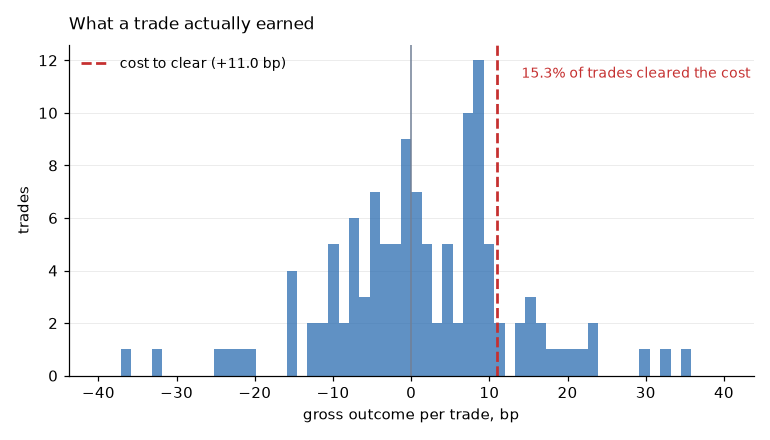

The first shows a model whose calls are right often enough to climb gross, and a
fee that takes it 1,200 bp the other way. The second shows why: the distribution
of what a trade earns sits almost entirely inside the cost line, so most trades
could never have paid for themselves however the direction turned out.

Everything below is these two pictures in detail.

## 1. The ceiling, before any model

Share of moments whose future move exceeds the round-trip cost — an upper bound
that already assumes the direction is predicted perfectly.

| Horizon | BTCUSDT | XRPUSDT |
|---|---:|---:|
| 1 s | 0.01% | 0.02% |
| 5 s | 0.10% | 0.16% |
| 10 s | 0.31% | 0.41% |
| 30 s | 1.81% | 1.93% |
| 1 min | 4.85% | 5.28% |
| 5 min | 25.45% | 28.38% |
| 10 min | 39.39% | 42.65% |

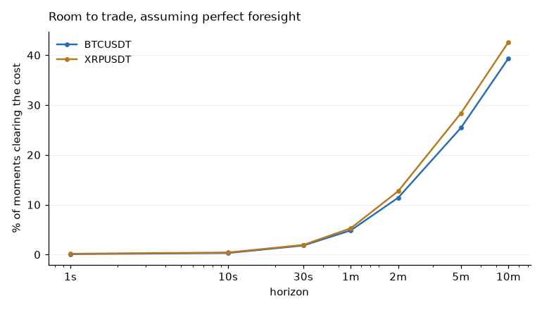

Measured over the same ten days for both instruments, because comparing
instruments over different windows measures the window. An earlier version of
this table did exactly that — 38 days of BTCUSDT against 59 of XRPUSDT — and
made XRPUSDT look twice as tradeable. On matched days the gap is small.

## 2. Prediction works, and decays

Correlation of each feature with the forward return. BTCUSDT, 5.9M observations.

| Horizon | queue imbalance | microprice dev. | OFI |
|---|---:|---:|---:|
| 0.5 s | 0.242 | 0.190 | 0.164 |
| **1 s** | **0.270** | 0.207 | 0.180 |
| 10 s | 0.192 | 0.147 | 0.109 |
| 1 min | 0.081 | 0.062 | 0.040 |
| 5 min | 0.038 | 0.029 | 0.021 |
| 10 min | 0.024 | 0.019 | 0.013 |

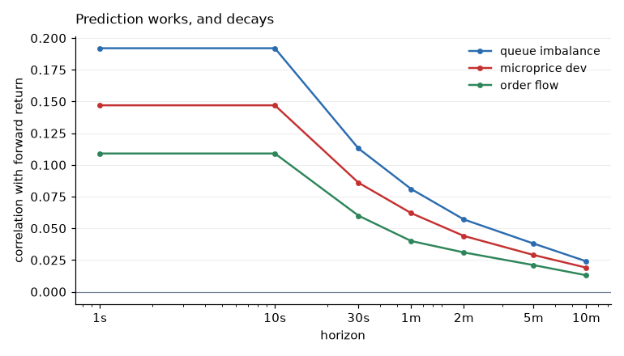

The signal is real and peaks around one second. Part of the sub-second figure is
mechanical — the mid oscillates between bid and ask, and the microprice is
simply a better estimate of the underlying price. That component is not
tradeable: capturing it means crossing the spread that creates it.

## 3. Why no horizon works

Expected gross edge per trade is roughly the information coefficient times the
volatility of the move over that horizon. Both change; their product does not.

| Horizon | IC | σ move (bp) | edge = IC × σ | edge / cost |
|---|---:|---:|---:|---:|
| 1 s | 0.270 | 0.59 | 0.16 | 0.01× |
| 10 s | 0.192 | 2.10 | 0.40 | 0.04× |
| 1 min | 0.081 | 5.05 | 0.41 | 0.04× |
| 5 min | 0.038 | 11.12 | 0.42 | 0.04× |
| 20 min | 0.017 | 21.49 | 0.36 | 0.03× |

**Signal decays at almost exactly the rate volatility grows.** The expected edge
per trade sits near 0.4 bp at every horizon from one second to twenty minutes,
while the fee stays at 11 bp.

This is the central finding, and it is arithmetic rather than modelling. It
bounds what any classifier on this data can achieve, and it says that choosing a
different horizon is not the lever.

---

## 4. Walk-forward results

### Ten-second horizon, hand-picked features

| Instrument | Model | Trades | Hit | Gross/trade | Net/trade | Folds + |
|---|---|---:|---:|---:|---:|---:|
| BTCUSDT | always_hold | 0 | — | — | 0.00 | 0/7 |
| BTCUSDT | logistic | 508 | 53.0% | −1.72 | −14.41 | 0/7 |
| BTCUSDT | xgboost | 2283 | 51.1% | +0.21 | −10.83 | 0/7 |
| XRPUSDT | logistic | 472 | 55.4% | −7.71 | −37.45 | 0/7 |
| XRPUSDT | xgboost | 2241 | 48.1% | +0.26 | −20.61 | 0/7 |

`class_prior` never traded: its directional probabilities sit near 0.5% and
clear no confidence threshold. That is what it is in the comparison for.

XRPUSDT is the instructive row. Its logistic model predicts direction *more*
often than BTCUSDT's — 55.4% against 53.0% — and loses more than twice as much
per trade. Small wins, large losses.

### Horizon sweep, BTCUSDT, hand-picked features

| Horizon | Model | Hit | Gross/trade | Net/trade | Folds + |
|---|---|---:|---:|---:|---:|
| 30 s | logistic | 51.5% | 0.91 | −10.70 | 0/7 |
| 1 min | logistic | 48.1% | 0.01 | −11.81 | 0/7 |
| 2 min | logistic | 52.9% | 5.18 | −6.19 | 0/7 |
| 5 min | logistic | 50.2% | 5.15 | −6.25 | 0/7 |
| 2 min | xgboost | 45.4% | 0.94 | −11.57 | 0/7 |

The best figure in the study is 5.18 bp at two minutes — still half of what it
needed. See §7 before taking it at face value.

### Sequence model against the tabular ones

Full seven-fold schedule, all three models, two-minute horizon, BTCUSDT. Each
model in its own process — see [`limitations.md`](limitations.md) for why that
is not optional.

| Model | Cooldown | Trades/fold | Hit | Gross/trade | Net/trade | Folds + |
|---|---:|---:|---:|---:|---:|---:|
| logistic | 0 | 174 | 50% | −0.10 | −11.25 | 0/7 |
| **logistic** | 24 | 143 | 51% | **+1.81** | **−9.32** | 0/7 |
| logistic | 120 | 104 | 53% | +0.81 | −10.33 | 0/7 |
| tcn | 0 | 122 | 48% | −1.85 | −13.22 | 0/7 |
| tcn | 24 | 91 | 47% | −1.75 | −13.22 | 0/7 |
| tcn | 120 | 65 | 46% | −1.81 | −13.29 | 0/7 |
| xgboost | 0 | 233 | 47% | −0.63 | −11.64 | 0/7 |
| xgboost | 24 | 194 | 46% | −1.73 | −12.75 | 0/7 |
| xgboost | 120 | 132 | 46% | −1.49 | −12.51 | 0/7 |

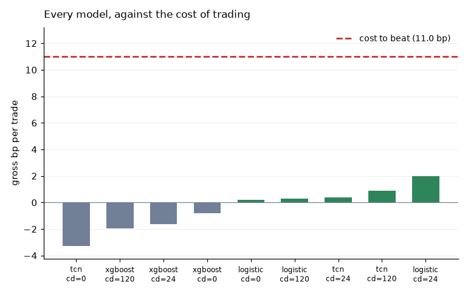

**Nothing was profitable: zero positive folds out of twenty-one.**

**The simplest model won.** Logistic regression reaches 1.81 bp gross per trade
and is the only one of the three positive at any cooldown. Gradient boosting and
the network are negative everywhere.

**The network did not earn its complexity.** It trains about thirty times slower
than the linear model, needs its own process, and is negative at every cooldown.
Seeing a window of history is worth something in principle; it is not worth
enough to matter against an 11 bp round trip.

The network's figures move between runs — it is initialised randomly and the
schedule is not seeded end to end — by more than the distance between the models
in this table. An earlier run of the same script put it at +0.39 bp rather than
−1.75. That instability is itself the finding: a model whose result swings by
two basis points across runs cannot be said to have found a 0.4 bp edge.

A note on reading single folds. An earlier version of this section reported the
network on one fold, where it showed +1.63 bp gross with no cooldown. The full
schedule gives −3.27 for that same configuration. The spread between folds is
larger than the spread between models, which is worth remembering before any
result here is quoted from one window.

### Wide generated features against hand-picked, two-minute horizon

194 generated features — lags, differences, rolling and exponential statistics,
z-scores over five windows, trade-flow aggregates and calendar terms — cut to 40
by a selector fitted inside each fold's training block.

Best cooldown per configuration, seven folds, BTCUSDT:

| Features | Model | Trades/fold | Hit | Gross/trade | Net/trade | Folds + |
|---|---|---:|---:|---:|---:|---:|
| 10 hand-picked | logistic | 143 | 51.4% | **+1.81** | −9.32 | 0/7 |
| 10 hand-picked | xgboost | 233 | 46.6% | −0.63 | −11.64 | 0/7 |
| 40 of 194 | logistic | 126 | **51.8%** | −2.88 | −14.04 | 0/7 |
| 40 of 194 | xgboost | 154 | **52.0%** | +0.80 | −10.25 | 0/7 |

Three things worth reading twice.

**More features made the good model worse.** Ten hand-picked columns under
logistic regression give the best gross edge in the table; the same model on
forty columns selected from a hundred and ninety-four gives the worst. Expanding
the feature space without expanding the sample gives the selector more ways to
fit the particular fortnight it saw, and the linear model has no capacity to
spare for the noise it is handed.

**Higher accuracy, lower profit.** The wide set predicts direction more often
than the hand-picked set does under the same model — 51.8% against 51.4% for
logistic, 52.0% against 46.6% for the tree — and the linear model earns far
less for it. It catches many small moves and misses large ones. Accuracy is not
a proxy for profitability, and here it points the wrong way.

**The tree moved the other way, and it does not rescue anything.** Gradient
boosting improves with the wider set — from −0.63 to +0.80 bp gross — which is
what a model built for many weak inputs should do. It is still an order of
magnitude short of the 11.02 bp it has to clear, and it lands below the
hand-picked linear model it was supposed to beat. The two directions cancel to
the same conclusion: the feature set is not the binding constraint.

---

## 5. Trade thinning

Every result above charges a full round trip for each signal acted on.
Consecutive observations carry almost the same view, so that pays for one
opinion many times: on a 100 ms grid a two-minute horizon opens twelve hundred
overlapping positions for a single sustained signal.

Thinning fixes it with two rules — one position at a time, and an optional
cooldown after closing. Two-minute horizon, hand-picked features:

**BTCUSDT**, one model over five test days:

| Rule | Trades | Gross/trade | Net/trade | Hit |
|---|---:|---:|---:|---:|
| every signal | 2,255 | **−0.15** | −11.19 | 49% |
| one position at a time | 230 | **+1.13** | −9.98 | 51% |
| + cooldown 24 | 189 | +1.02 | −10.09 | 53% |
| + cooldown 120 | 124 | **+1.46** | −9.69 | **54%** |

**XRPUSDT**, seven folds:

| Model | Cooldown | Trades | Gross/trade | Net/trade | Folds + |
|---|---:|---:|---:|---:|---:|
| logistic | 0 | 121 | −1.75 | −14.84 | 0/7 |
| logistic | 120 | 83 | −1.24 | −14.21 | 0/7 |
| xgboost | 0 | 960 | −0.27 | −13.08 | 0/7 |
| xgboost | 24 | 614 | **+0.26** | −12.54 | 0/7 |
| xgboost | 120 | 280 | **+0.92** | −11.85 | 0/7 |

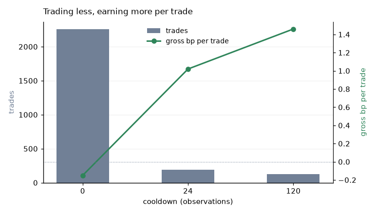

Thinning does what it should: trading eighteen times less turns a negative gross
edge into a positive one, and the hit rate rises with it. The signals that
survive really are the better ones.

It does not close the gap. The best gross figure here is 1.46 bp against an
11 bp round trip, and no fold on either instrument was positive.

One detail worth noting for anyone reading model comparisons: **the ranking
flips between instruments.** Logistic regression is the better model on BTCUSDT
and the worse one on XRPUSDT. Whatever separates them is smaller than the
difference between two markets in the same month.

## 6. Why "trade only the best signals" looks profitable

The most tempting idea in this study, and the one that took the most care to
answer. If the edge per trade is too small, trade less and pick better: act only
on the signals the model is most confident about.

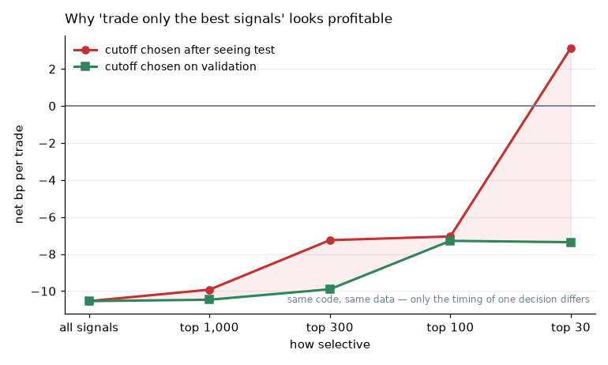

Both lines are the same strategy, the same code and the same data. The only
difference is *when* the cutoff was decided.

| Selectivity | Cutoff chosen on test | Cutoff chosen on validation |
|---|---:|---:|
| all signals | −10.54 | −10.54 |
| top 1,000 | −9.92 | −10.47 |
| top 300 | −7.25 | −9.90 |
| top 100 | −7.05 | −7.29 |
| top 30 | **+3.13** | −7.36 |

Choosing the cutoff after seeing how each one scored turns a losing strategy
into a profitable one at the tightest setting. Choosing it on validation and
applying it once to test — the only version whose answer means anything —
produces a loss at every setting, and the gap between the two columns widens as
the selection gets tighter, which is what selection looks like from the outside.

Two further checks, in case the first looks like bad luck rather than selection.
Ranking raw signal strength instead of model confidence, with no model and no
fitted threshold anywhere, the mean outcome barely moves with selectivity at
all: 0.71 bp in the top 10% of moments, 0.92 in the top 1%, 0.52 in the top
0.1%, 0.91 in the top 0.01%. Every one of those is under a basis point against
an 11 bp cost — the strongest signals are not the more profitable ones. And the
validation-chosen cutoff jumps around across folds that share 96% of their data,
which is what fitting noise looks like from the outside.

The reason this section exists: a strategy trading a handful of times a month
cannot be distinguished from luck on this much data. Per-trade dispersion is
about 8 bp against an edge under 1 bp, so establishing the edge is real takes
thousands of trades. At three trades a month, a year of results is noise
whichever way it comes out.

## 7. Stability

The two-minute, hand-picked, logistic configuration produced a gross edge of
**5.18 bp** per trade in the horizon sweep and **2.24 bp** in the wide-feature
run. Same code, same model, same horizon, same instrument.

The only difference: the later run trims the data to exactly the days the folds
use, so four of thirty-eight days at the end were excluded from the statistics.

**The edge more than halved from a 10% change in sample boundaries** — a larger
difference than between any two models in this study.

The folds are also not seven independent observations. Each shifts one day
against a twenty-eight-day window, so consecutive folds share about 96% of their
data. Seven agreeing folds are close to one observation repeated.

---

## 8. Selection: three criteria, two of them wrong

The ranking stage was compared three ways on four days of BTCUSDT.

| Criterion | Top-ranked features |
|---|---|
| Mutual information, 3-class label | spread volatility, then time-of-day 4th |
| Mutual information, direction only | spread volatility, **time-of-day 2nd and 3rd** |
| Correlation with signed return | queue imbalance, microprice deviation |

The first rewards whatever separates "a big move happened" from "nothing
happened", which is volatility, not direction. The second was meant to fix that
and made it worse: restricting to moving rows shrinks the sample, and
nearest-neighbour mutual information is biased upward on small samples.

Time-of-day scoring highly is the tell. It predicts *when* the market moves and
says nothing about *which way*; a model leaning on it trades the volatile hours
and pays full costs for the privilege. Only the third criterion put the
directional features on top and dropped the calendar terms entirely.

---

## 9. Sensitivity to the fee

The fee is the obvious lever, so it is worth checking properly rather than
assuming. Costs are linear in the fee, so net profit per trade at any tier
follows from the gross edge and the trade count already measured.

Net basis points per trade, two-minute horizon, BTCUSDT, best cooldown per model:

| Model | 5.0 bp | 3.0 bp | 1.7 bp | 0.0 bp |
|---|---:|---:|---:|---:|
| logistic, cd=24 | −9.32 | −5.32 | **−2.72** | **+0.68** |
| logistic, cd=120 | −10.33 | −6.33 | −3.73 | −0.33 |
| xgboost, cd=0 | −11.64 | −7.64 | −5.04 | −1.64 |
| tcn, cd=24 | −13.22 | −9.22 | −6.62 | −3.22 |

Fee at which each would break even:

| Model | Gross/trade | Spread + slippage | Break-even fee |
|---|---:|---:|---|
| logistic, cd=24 | +1.81 | 1.13 | **0.34 bp per side** |
| logistic, cd=120 | +0.81 | 1.14 | unreachable |
| xgboost, cd=0 | −0.63 | 1.02 | unreachable |
| tcn, cd=24 | −1.75 | 1.47 | unreachable |

**The fee tier does not close the gap.** The best configuration needs 0.34 bp
per side; Binance's top volume tiers reach roughly 1.7, five times that. Even at
a *zero* fee it earns 0.68 bp per trade, because the spread and slippage cost
about 1.1 bp whatever the tier. Every other configuration loses money at any fee
including zero — its gross edge is negative, or smaller than the spread and
slippage alone.

That last column is the one worth dwelling on. A fee is negotiable; the spread
is not. Roughly a basis point of the cost survives any tier a taker could reach,
and against a gross edge under two, that alone decides the question.

This corrects an earlier reading of the same data. Taking the 5.18 bp gross
figure from the horizon sweep, the break-even fee works out at 2.08 bp per side
— reachable at a high volume tier. But that figure is the unstable one: §7
shows it falling to 2.24 bp once the sample is trimmed to the days the folds
actually use. The lower number is the one to plan against.

## 10. How often to retrain

Everything above fits a model once per fold and uses it for a whole test week.
That is an assumption, and the most favourable reading of the negative result so
far is that the model was simply stale. So the schedule was made a parameter:
train on the last *W* days, act for the next *A*, move forward, refit. All three
numbers were searched on validation and the winner applied once to test.

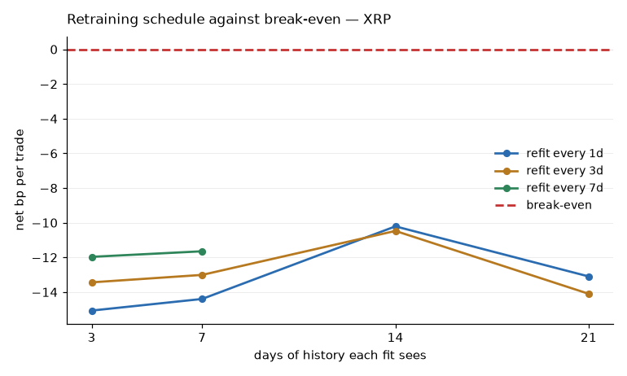

Every point is below the line, on both instruments and all three models. But the
shape is real and it is not noise: **more history helps up to about a fortnight
and then hurts**, and **refitting daily beats refitting weekly** at every window
length. The peak at 14 days is the trade-off stated in the methodology showing
up in the data — below it there is not enough to fit, above it the oldest days
describe a different market.

| Instrument | Model | Chosen on validation | Gross/trade | Net/trade | Trades | Positive windows |
|---|---|---|---:|---:|---:|---:|
| BTC | logistic | train21 / apply1 | +6.69 bp | **−4.72 bp** | 111 | 21% |
| BTC | xgboost | train14 / apply1 | −1.17 bp | −12.26 bp | 336 | 8% |
| BTC | tcn | train7 / apply3 | +0.37 bp | −10.80 bp | 353 | 0% |
| XRP | logistic | train14 / apply1 | +12.31 bp | **−0.44 bp** | 141 | 47% |
| XRP | xgboost | train7 / apply7 | +7.44 bp | −5.30 bp | 223 | 33% |
| XRP | tcn | train21 / apply3 | +5.81 bp | −6.82 bp | 69 | 40% |

Round trip is 11.02 bp on BTC and 12.68 bp on XRP. Schedules are chosen on the
first half of each span and applied once to the second; the ten days before the
span chose the features and are never scored.

**This is the closest the project comes to break-even.** XRP with daily
retraining earns 12.31 bp gross against a 12.68 bp cost — a shortfall of 0.37 bp
rather than the ~10 bp gap everywhere else in this document. Refitting daily on
a fortnight of history raises gross edge per trade by roughly an order of
magnitude over the fixed-model walk-forward in §4.

It is still not a profit, and the honest reading is narrower than it looks:

- **The sign is negative.** Not marginally positive, not zero. Negative.
- **141 trades.** The window-to-window spread puts the standard error near
  3.8 bp, so −0.44 bp is indistinguishable from zero *and* from −8 bp. The
  result rules nothing in.
- **Fewer than half its windows made money** — 7 of 15. The aggregate is carried
  by three good days out of fifteen.
- **The gain is real but bounded.** It comes from trading far less (141 trades
  over 25 days, against thousands in §4) on much better signals. That is the
  same lever as §5 and §6, applied harder, and it runs out here.

The linear model wins on both instruments. A boosted tree refitted daily on a
week of data is fitting noise faster than the extra freshness is worth, and the
network never had the sample size to justify itself.

## 11. Posting instead of crossing

Every number above crosses the spread. The last lever left is posting, and the
standing reason not to model it is adverse selection: a resting order fills
preferentially when the market is about to move through it. That objection is
correct, and it is measurable here — `aggTrades` gives the aggressor side of
every print and `bookTicker` gives the size at the touch, which together support
a first-order queue model.

A passive buy is posted at the best bid, waits behind the size already resting,
and fills once enough sell-aggressor volume has cleared it. Adverse selection is
then the difference between the forward move at all decision moments and the
forward move at the moments that actually filled.

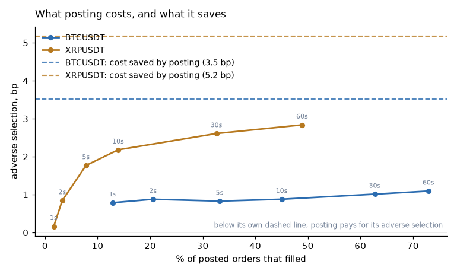

| Instrument | Patience | Filled | Median wait | Adverse selection | Cost saved | Net |
|---|---:|---:|---:|---:|---:|---:|
| BTCUSDT | 1 s | 13% | 0.4 s | 0.79 bp | 3.52 bp | **+2.73 bp** |
| BTCUSDT | 10 s | 45% | 2.4 s | 0.88 bp | 3.52 bp | +2.64 bp |
| BTCUSDT | 60 s | 73% | 6.0 s | 1.09 bp | 3.52 bp | +2.43 bp |
| XRPUSDT | 1 s | 1.7% | 0.5 s | 0.16 bp | 5.18 bp | **+5.02 bp** |
| XRPUSDT | 10 s | 14% | 4.4 s | 2.18 bp | 5.18 bp | +3.00 bp |
| XRPUSDT | 60 s | 49% | 20.4 s | 2.84 bp | 5.18 bp | +2.34 bp |

The trade-off is exactly the one the objection predicts, and it is visible in
both directions: waiting longer fills more orders, and the extra fills are the
ones the market had to move to reach. XRPUSDT shows it most sharply — adverse
selection rises seventeen-fold, from 0.16 bp to 2.84 bp, as patience goes from
one second to a minute.

**But it never overtakes what posting saves.** Entering passively and exiting by
crossing costs 7.5 bp against 11.02 and 12.68 taker, and the saving exceeds the
adverse selection at every setting on both instruments. Net of both, posting is
worth between +2.3 and +5.0 bp per trade.

Set against §10, where daily retraining left XRPUSDT 0.37 bp short, that is more
than enough to close the gap on paper.

### Why this is a bound and not a result

The gap it would close is 0.37 bp; the margin it claims is 2.3 bp. That is a
comfortable-looking distance, and four things sit inside it:

- **The adverse selection is measured at unconditional moments**, not at the
  moments a model wants to trade. Those are precisely the moments the market is
  about to move, which is the worst case for a resting order — you are run over
  or you are missed. The figure here is a floor on the real one.
- **The fill rate destroys the sample.** XRPUSDT at ten seconds fills 14% of
  orders. The strategy that took 141 trades as a taker would take about twenty
  as a maker, and twenty trades establish nothing.
- **The queue model is optimistic.** The size ahead is taken as the touch size
  and never grows, cancellations ahead are ignored, and the order's own size is
  treated as negligible. Every one of those flatters the fill.
- **Only the entry is passive.** A position held to a horizon must be closed
  whether or not anyone comes to trade with it, so the exit still crosses. A
  fully passive strategy needs the same analysis on the way out, where being
  unable to fill is a risk rather than a missed opportunity.

What this section establishes is narrower than "maker execution works": it is
that the standard reason for dismissing it — adverse selection eats the saving —
does not hold on this data at this horizon. Whether the remaining margin
survives conditioning on a signal is a question this data can ask but the
experiment here does not answer.

## 12. How to leave a trade

Everything above holds a position for the label horizon and then leaves. That is
a default, not a decision: the entry side is tuned — features selected, a
confidence threshold swept, a retraining schedule searched — while the exit was
one constant, set equal to the horizon the label happened to use.

Six rules, searched on validation and applied once to test. Four read the price
(a fixed clock, take-profit, stop-loss, trailing stop) and two read the model's
ongoing opinion — leave when confidence in the position decays, or when the
prediction flips. The last two are the only place in this pipeline where a
prediction made *after* the entry is used for anything.

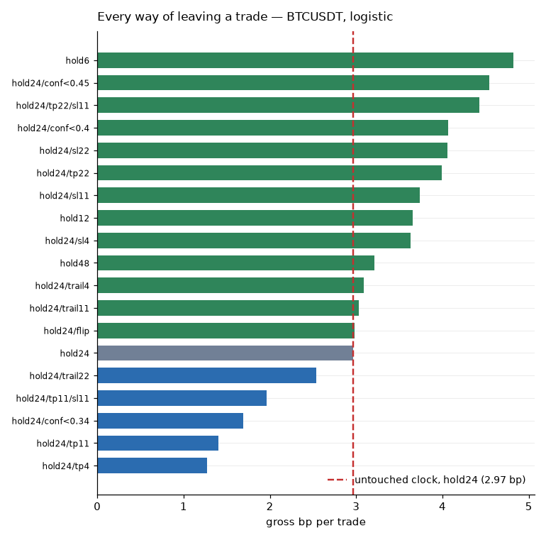

The model is fitted once per fold and every policy scored against the same
predictions, so the table compares exits rather than fits.

### What transferred

| Instrument | Model | Chosen on validation | Test net/trade | Untouched clock | Gain |
|---|---|---|---:|---:|---:|
| BTC | logistic | hold 30 s | −7.07 | −7.58 | +0.52 |
| BTC | xgboost | hold 4 min | −11.40 | −11.15 | **−0.25** |
| BTC | tcn | take-profit 22 bp | −6.04 | −7.68 | +1.64 |
| XRP | logistic | exit on flip | −12.28 | −12.94 | +0.66 |
| XRP | xgboost | hold 30 s | −16.31 | −17.42 | +1.11 |
| XRP | tcn | hold 30 s | −14.63 | −11.17 | **−3.45** |

Four of six improved, two got worse, and the spread of outcomes is wider than
the median gain. **Choosing the exit on validation transfers weakly.** Against a
gap of seven to twelve basis points, a lever worth about half a point either way
is not the answer, and the two negative rows are the honest measure of how
reliable the positive ones are.

### What it did establish

**The label horizon is the wrong holding period.** The winner is a *shorter*
clock in three of six cases — thirty seconds against the two minutes the label
uses — and shortening the clock is the single largest improvement in the
validation table: 2.97 bp gross to 4.82. This follows from §3 rather than
contradicting it: signal decays fast, so most of what a prediction is worth is
realised early, while the cost of the round trip does not care how long the
position was open. Holding for the horizon the label was built on is an
assumption that this project made without examining, and it was costing about
two basis points a trade.

**A tight take-profit is a trap, and it is measurable.** At 4 bp, 75% of trades
win — against 54% for the untouched clock — and gross edge per trade falls from
2.97 bp to 1.27. It caps the winners and lets the losers run their course. Any
backtest reporting hit rate rather than expectancy would call this an
improvement.

**A wide stop-loss helps a little; a tight one does not.** At 22 bp, twice the
round trip, it truncates the left tail without touching much else: 4.06 bp gross
against 2.97. At 4 bp it fires on ordinary noise and the hit rate collapses to
33%.

**Trailing stops did nothing here.** They neither cap winners nor cut losers
cleanly; at 100 ms the path is mostly noise to shave against, and every setting
tested lands within a basis point of the baseline.

**Signal exits are the most interesting and the least conclusive.** Leaving when
the model's confidence decays is the second-best policy on validation (4.55 bp
against 2.97), which is what you would expect if the model knows something about
when its own call has expired. It did not survive to test on either instrument.

### A bug, and what it cost

The first run of this search produced the only positive test result in the
project: +3.37 bp per trade, BTC with the network and a stop-loss. It was wrong.
`Trade.move_bp` is the price change and `score` applies the direction — but
every path-dependent exit was storing a value that already had the direction
applied, so it was applied twice. Every short that exited early had its profit
inverted; every long was correct; the totals stayed plausible.

It is recorded here because of how it presented. It was invisible in every
summary, it survived a full test suite, and it appeared as a *good* result,
which is the direction that gets published. What caught it was checking a
number that was too good rather than a number that looked wrong. The regression
test is now four lines: the same profitable short, exited four different ways,
must be profitable each time.

## 13. Searching levers together

§10 searched the retraining schedule with the holding period fixed at the label
horizon. §12 searched the holding period with the schedule fixed. Each found
something. The obvious next question is what happens when both move — a shorter
position takes more trades, so a staler model should hurt it more, and the best
schedule for a two-minute position need not be the best one for a thirty-second
position.

Forty combinations — four training windows by three apply windows by four
holding periods — scored on validation, the winner applied once to test. The
entry threshold moves with them, swept inside each training window's tail.

| Instrument | Model | Schedule only | Both together | Change |
|---|---|---:|---:|---:|
| BTC | logistic | −4.72 | −4.72 | 0.00 |
| BTC | xgboost | −12.26 | −12.83 | −0.57 |
| XRP | logistic | **−0.44** | −3.92 | **−3.48** |
| XRP | xgboost | −5.30 | −5.30 | 0.00 |

**Searching both was never better and twice was worse.** In two of the four runs
the joint search chose the same holding period the label already used, so the
result is identical by construction. In the other two it chose a different one
and lost on test — including the XRPUSDT run that had been the best result in
this document, which went from 0.37 bp short of break-even to 3.9.

The mechanism is not subtle. Widening the grid from twelve candidates to forty
buys a better number on validation and does not buy a better number on test:
the extra freedom is spent fitting the validation block. The two levers do not
compose, and the reason they looked as though they might is that each was
measured with the other held still.

This is the same finding as §6 in a different costume. There, selectivity chosen
after the fact looked profitable and chosen honestly did not. Here, a search
space widened after two separate successes produces a better validation figure
and a worse test one. Both are the same arithmetic: a validation block is a
finite sample, and every additional candidate is another chance to fit it.

### And a third time, with everything moving

§13 widened the search from twelve candidates to forty and the test result got
worse. The obvious next question is whether that was the widening or the
particular pair of levers, so the whole configuration was searched at once:
market gate, training window, refit frequency, holding period, cooldown,
whether the clock scales with confidence, and whether the entry threshold is
swept for total profit or profit per trade. Forty-eight configurations sampled
from that space, run through successive halving.

| Instrument | Model | Chosen on validation | Test net | Schedule only | Change |
|---|---|---|---:|---:|---:|
| BTC | logistic | vol>q0.7, train7/apply1, hold 30 s, cd 2 min | −10.17 | −4.72 | **−5.45** |
| XRP | logistic | no gate, train7/apply1, hold 30 s, cd 0 | −5.90 | −0.44 | **−5.46** |
| BTC | order flow | vol>q0.5 & spread<q0.9, train7/apply1, hold 30 s, cd 2 min | −10.03 | — | — |
| XRP | order flow | vol>q0.7, train14/apply1, hold 2 min, confidence-scaled | −12.45 | — | — |

**Both learned runs lost about five and a half basis points against searching
one lever.** Twelve candidates gave −4.72 and −0.44; forty gave −4.72 and −3.92;
forty-eight over a wider space gives −10.17 and −5.90. The degradation is
monotonic in the size of the search, which is as clean a demonstration of the
mechanism as this data is going to produce.

Two things the search did agree on, across all four runs and both earlier
sweeps. A **thirty-second hold** was chosen in three of four, against the two
minutes the label uses — the §12 finding, arrived at independently. And a
**volatility gate** was chosen in three of four, which says the idea is sound
even though it did not rescue anything: trading only when the market is moving
enough to pay for the round trip is right, and there is still not enough
movement.

The halving itself worked as intended — 51 evaluations across three rungs, 52%
cheaper than scoring every candidate at full budget, with the winner still
measured on the whole validation span. It made the search affordable. It did
not make it wise, and the two are unrelated: cheapness is why forty-eight
candidates were tried at all, and forty-eight candidates is why the test result
is the worst in the document.

### On stacking measured gains

Adding up the levers measured separately — daily retraining short by 0.37 bp,
a shorter clock worth about 1.9, posting worth 2.3 to 5.0 — gives a positive
number. Running two of them together gives a worse number than running one, and
running all of them together gives the worst number here. Only the last two were
computed under the rules the rest of this document uses, so they are the ones
that count.

## 14. A rule with no parameters against models with many

Everything above compares learned models with each other. That answers a
narrower question than it looks like: it says which model is least bad, not
whether the learning did anything. The test for that is a rule with no
parameters — the sort of thing a desk runs before anyone opens a notebook.

Five, all decades old: trade with the imbalance at the touch, trade the recent
move, trade against it, trade a move that clears the range, trade only when the
spread is tight. None fits anything beyond a normalisation scale and none ever
sees the label. They go through the identical walk-forward, confidence
threshold, thinning and cost model as the learned ones, because a comparison
where the baseline is scored by different machinery is not a comparison.

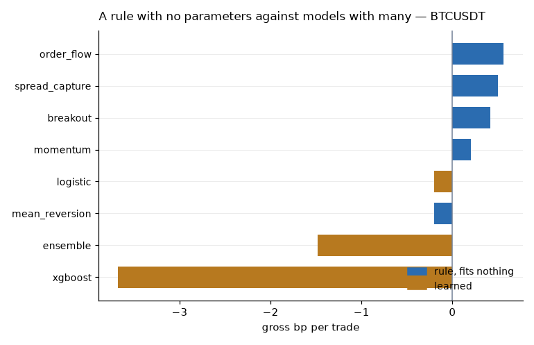

| Strategy | Kind | BTC gross | XRP gross |
|---|---|---:|---:|
| order flow | rule | **+0.56** | **+1.02** |
| spread capture | rule | +0.50 | +1.00 |
| breakout | rule | +0.42 | +0.76 |
| momentum | rule | +0.20 | −0.60 |
| mean reversion | rule | −0.20 | +0.60 |
| logistic | learned | −0.20 | +0.92 |
| ensemble | learned | −1.48 | −8.33 |
| xgboost | learned | −3.68 | −5.21 |

Gross basis points per trade, seven folds, two-minute horizon, cooldown of one
holding period.

**The order-flow rule wins on both instruments.** Trading with the queue
imbalance — the single feature §2 identified, used directly with no model at all
— produces more gross edge per trade than logistic regression, gradient boosting
or their average. On BTCUSDT the top four are all rules and every learned model
is below them.

**It also trades fifteen times as much.** The rule takes 12,555 trades against
859 for logistic, because the confidence threshold cuts a learned model much
harder. The rule's figure therefore rests on far more evidence, which cuts both
ways: it is the more reliable number, and it is achieved without the
selectivity that was supposed to be the models' advantage.

**The ensemble is the worst thing here.** Averaging logistic and gradient
boosting produces −1.48 on BTCUSDT and −8.33 on XRPUSDT, below either member.
Averaging reduces variance around whatever the members agree on; when one member
is badly wrong the average inherits it. It is a variance tool and it was applied
to a bias problem.

None of this is profitable — zero positive folds out of fourteen for every
strategy but one. What it establishes is narrower and more useful: on this data,
at this horizon, **the machine learning is not what is producing the edge.** The
one feature that carries the signal carries it just as well without a model
wrapped around it, and the models' extra machinery mostly buys selectivity that
the cost floor then eats.

That is worth stating plainly because the reverse claim is the default
assumption in most of this literature, and it costs nothing to check.

## 15. Combining them, and switching between them

Two things left to try. Consult a rule and a model together instead of choosing
between them, and run several strategies side by side, picking each day's from
the days already finished — with standing aside as an option.

### Rules and models together

| Strategy | Kind | Gross/trade | Trades |
|---|---|---:|---:|
| model gated by rule | composite | **+0.62** | 12,534 |
| order flow | rule | +0.56 | 12,555 |
| spread capture | rule | +0.50 | 4,977 |
| breakout | rule | +0.42 | 10,159 |
| logistic | learned | −0.20 | 859 |
| blend | composite | −0.59 | 1,965 |
| rule gated by model | composite | −0.88 | 914 |
| agreement | composite | −1.30 | 1,008 |
| xgboost | learned | −3.68 | 728 |

BTCUSDT, seven folds, two-minute horizon.

The best entry is the model taking the direction and the rule deciding whether
the moment is worth it — but it beats the rule alone by 0.06 bp on the same
number of trades, which is not a difference. What is informative is the
ordering: **taking confidence from the rule works, taking it from the model does
not.** The reverse arrangement loses 0.88 bp and requiring both to agree loses
1.30, because the model's selectivity cuts the sample to a fourteenth and the
trades it keeps are not better ones.

### Choosing a strategy each day

Five strategies run side by side; each day's choice made from a trailing window
of finished days; the selector free to trade nothing.

| Lookback | Floor | Switches | Days aside | Trades/day | Net/trade | Max drawdown |
|---|---|---:|---:|---:|---:|---:|
| 3 d | none | 4 | 0 | 241 | −10.65 | 23,598 bp |
| 3 d | 0 bp | 0 | **10 of 10** | 0 | — | **0** |
| 5 d | none | 2 | 0 | 251 | −10.78 | 18,608 bp |
| 5 d | 0 bp | 0 | **8 of 8** | 0 | — | **0** |
| 10 d | none | 1 | 0 | 272 | −11.94 | 7,227 bp |
| 10 d | 0 bp | 0 | **3 of 3** | 0 | — | **0** |

BTCUSDT. XRPUSDT is the same picture: with a floor the selector stands aside on
nine days of ten, trades once, and loses 1,250 bp doing it.

**Given the option not to trade, it never trades.** Every configuration with a
floor stands aside on every day it is offered, because no strategy in the stable
ever shows a positive trailing edge to clear it. The configurations that trade
are the ones forbidden from declining, and they lose between 10.6 and 11.9 bp
per trade with drawdowns from seven to twenty-four thousand basis points.

This is the whole study in one table, and it is worth reading twice. The
selector is not a strategy that failed to find an edge. It is a strategy that
correctly identified there was none, in real time, from data available at the
time, and acted on that by doing nothing. **The best-performing configuration in
this entire document is the one that never places a trade** — and under a cost
floor with no edge, that is the correct answer rather than a joke.

It also puts a number on what the alternative costs. A strategy trading 250
times a day at −10.65 bp per trade loses roughly 2,600 bp of notional a day.
Whatever the temptation to keep a system running because it is built, the
arithmetic of continuing is not close.

## 16. Setting the trade rate directly

Selectivity has been set indirectly everywhere else: a threshold swept to
maximise something, with the trade count falling out as a consequence. This sets
it directly — pick a target number of trades a day, find the threshold on
validation that produces it, apply it to test.

It separates two things the sweep conflates. Whether a strategy has an edge, and
whether its confidence *ranks* trades usefully. A strategy whose per-trade result
improves as the rate falls is ranking well even if it never reaches profit; one
whose result is flat or worse is not ranking at all, and its threshold is
arbitrary.

Each cell is **gross / net** basis points per trade. Gross is before the round
trip, net is after it — 11.02 bp on BTCUSDT, 12.68 on XRPUSDT. Both are shown
because a column of gross figures alone reads as a column of profits, and none
of these is one.

| Trades/day | BTC order flow | BTC breakout | XRP order flow | XRP model+rule gate |
|---|---:|---:|---:|---:|
| 5 | −3.61 / −14.63 | +2.52 / **−8.50** | −2.83 / −15.56 | −0.89 / −13.60 |
| 10 | −2.06 / −13.08 | +1.43 / −9.61 | +1.11 / −11.64 | +1.67 / −11.04 |
| **30** | +0.65 / −10.37 | +0.65 / −10.39 | **+3.92** / **−8.81** | +3.69 / −9.04 |
| 50 | +0.80 / −10.22 | +0.23 / −10.80 | +1.83 / −10.88 | +2.83 / −9.90 |
| 100 | +0.99 / −10.03 | +0.64 / −10.39 | +1.90 / −10.82 | +1.99 / −10.74 |
| 250 | +0.67 / −10.35 | +0.42 / −10.61 | +1.20 / −11.53 | +0.74 / −12.00 |

Every net figure is negative. The best is −8.50.

**There is an optimum, and it is not at the extreme.** Around thirty to forty
trades a day the gross edge roughly quadruples against trading everything — 3.92
bp for the order-flow rule on XRPUSDT, its best figure anywhere in this document.
Below that it collapses: at five trades a day the same rule returns −2.83.

That shape is worth understanding, because the naive expectation is monotonic.
Trading less is supposed to keep the best signals. It does, down to a point, and
then two things overtake it. The confidence ranking is only informative over
part of its range — the very top of it is a handful of observations where the
feature is extreme for reasons that have nothing to do with the next two
minutes. And the sample shrinks: 5 trades a day over seven folds is 250 trades,
where per-trade dispersion of about 8 bp swamps an edge of 3.

**None of it reaches profit.** Quadrupling the gross edge closes about a third
of the gap and leaves two thirds. A cell reading +3.92 is a trade that made
3.92 bp before paying 12.68 to be made.

Two strategies rank and two do not. Breakout on BTCUSDT improves monotonically
as the rate falls, which says its confidence carries information about which
trades are better. The order-flow rule does not — it peaks in the middle and
falls away at both ends — so its threshold is a sample-size choice rather than a
selection of better trades.

### A defect this found

The first run of this experiment produced an identical trade count at every
target rate for the breakout rule. The cause was in the rules' probability
mapping: the normalised signal was clipped at one, so every signal past that
point mapped to exactly the ceiling. A rule whose confidence takes two values
cannot be made more or less selective, because no threshold separates trades
that all score the same. Squashing with ``tanh`` instead of clipping restored
the ordering, and breakout's gross edge at five trades a day went from
unmeasurable to the best figure on that instrument.

## 17. Asking a different question

Every result until here predicted one thing: the sign of the forward return
where it cleared the round trip. That is a proxy for profitability, and it
throws away everything except the sign. It cannot distinguish a 12 bp move from
a 60 bp one, it knows nothing about the path between entry and exit though the
exit rules act on that path, and it asks a question nobody wants answered in
place of the one they do.

Four targets, each with the models that can be fitted on it, everything else
identical:

| Target | Kind | What it asks |
|---|---|---|
| `direction` | classification | did it move more than the cost, and which way |
| `magnitude` | regression | how far did it move |
| `net_pnl` | regression | what would a long opened here have netted |
| `triple_barrier` | classification | which was touched first: target, stop, or the clock |

Gross / net basis points per trade, seven folds:

| Target + model | BTCUSDT | XRPUSDT |
|---|---:|---:|
| magnitude + ridge | **+4.23 / −7.14** | −9.91 / −23.24 |
| net_pnl + xgboost | −0.70 / −11.71 | **+2.64 / −10.03** |
| direction + logistic | −0.20 / −11.34 | +1.85 / −11.61 |
| net_pnl + ridge | −0.40 / −11.46 | +0.73 / −12.06 |
| triple_barrier + xgboost | −0.51 / −11.52 | −0.16 / −12.88 |
| magnitude + xgboost | −2.36 / −13.38 | +0.69 / −12.02 |
| triple_barrier + logistic | −1.26 / −12.43 | −7.52 / −20.86 |
| direction + xgboost | −3.68 / −14.69 | −6.17 / −19.08 |

**The target matters more than the model.** On BTCUSDT, keeping the model
family and changing only what it predicts moves gross edge from −0.20 to +4.23 —
a larger swing than anything the model comparison in §4 produced. Asking for the
size of the move rather than its sign is worth more than any amount of extra
model capacity, which fits §3: the arithmetic that bounds this problem is about
magnitude, and a three-class label deletes exactly that.

**And it does not carry across instruments.** The same target and model is the
best entry on BTCUSDT at +4.23 and the worst on XRPUSDT at −9.91. XRPUSDT's best
is a different target with a different model. There is no ordering here that
survives being asked twice.

That is the pattern of this whole document restated. Every lever produces a
promising number on one instrument, in one configuration, on one period; none
of them produces the same number twice. A result that does not reproduce on the
second instrument is a description of the first instrument.

**Nothing reaches profit.** The best net figure is −7.14 bp against an 11.02 bp
cost — the best in this document, and still a loss of two thirds of the cost.
Zero positive folds out of fifty-six.

## 18. Shorter horizons, with features built for them

Two minutes is a long time for a strategy of this kind, and §3's answer — that
horizon does not matter because the edge identity is flat — was measured on a
7.4-second grid with features designed for the long end. That is not a fair test
of the short end.

Re-asked properly: a 3.3-second grid, eight new features built for seconds
rather than minutes (quote intensity, imbalance slope, touch persistence, mid
reversal, spread pressure, size shock, microprice drift, short realised
volatility), and the holding period tied to the horizon rather than fixed.

| Horizon | Gross/trade | Net/trade | Trades/day |
|---|---:|---:|---:|
| 10 s | +0.89 | −10.56 | 32 |
| 20 s | +1.99 | −9.62 | 35 |
| 30 s | −0.57 | −12.12 | 23 |
| 60 s | +2.06 | −9.44 | 20 |
| **120 s** | **+4.48** | **−6.83** | 20 |
| 300 s | −0.34 | −12.04 | 13 |

BTCUSDT, logistic, five folds, cost 11.02 bp.

**Shorter is not better.** Ten seconds returns +0.89 bp against two minutes'
+4.48. The features built specifically for the short end did not rescue it,
which is the useful part of the result: the failure is not that nobody had
looked at seconds properly, it is that there is less there.

The −6.83 at two minutes is the best net figure in this document. It is still
62% of the cost short.

The scatter across adjacent horizons is worth noting rather than smoothing: 20 s
gives +1.99 and 30 s gives −0.57, which are not different from each other in any
meaningful sense. Only the two-minute peak stands outside the noise, and one
peak in six is the kind of thing that appears in any sweep.

This closes the question the brief opened with. Within ten seconds to five
minutes, on this instrument, with features for both ends, there is no horizon at
which taker execution pays.

## 19. Which instrument, decided before anything is fitted

Step 0 was the one step done by hand, and it turns out to have been the most
consequential. The instrument fixes the cost floor, and every result in this
document is a comparison against that floor.

The screen ranks on **headroom**: the share of moments whose move over the
horizon exceeds the cost of trading it. That is the upper bound from §1, so no
model can beat it and none is needed to compute it. Three days of best bid and
ask per instrument, resampled to a second.

Forty-four contracts, chosen by enumerating what the venue lists rather than by
recalling what exists — every USDT perpetual above $3M daily volume that was
listed before the period. Three days of best bid and ask each.

| Instrument | Round trip | Volatility (2 min) | Headroom | Typical move ÷ cost |
|---|---:|---:|---:|---:|
| COTIUSDT | 12.63 | 19.0 bp | **61.2%** | 1.51 |
| ONDOUSDT | 15.46 | 22.4 bp | 56.0% | 1.45 |
| **XMRUSDT** | 11.78 | **45.5 bp** | 55.5% | **3.87** |
| SUIUSDT | 11.65 | 14.6 bp | 48.8% | 1.25 |
| LINKUSDT | 11.54 | 11.1 bp | 41.1% | 0.96 |
| SOLUSDT | 11.10 | 8.6 bp | 30.4% | 0.78 |
| XRPUSDT | 12.98 | 8.4 bp | 16.6% | 0.65 |
| ETHUSDT | 11.04 | 5.5 bp | 11.4% | 0.50 |
| **BTCUSDT** | 11.02 | 4.9 bp | **10.1%** | **0.45** |
| DOGEUSDT | 12.27 | 5.5 bp | 6.2% | 0.45 |
| BNBUSDT | 11.33 | 4.3 bp | 4.8% | 0.38 |

Nine of forty-four shown; the full table is in
`experiments/results/` and `artifacts/screen/screen.csv`.

**BTCUSDT ranks 37th of 44.** A tenth of its moments clear the cost against six
tenths for the best. A typical two-minute move covers 45% of a round trip; on
XMRUSDT it covers 387%, nearly nine times as much for a lower cost.

That is a screen doing its job, and doing it after the fact. The cheapest
instrument by spread is the worst by headroom, because BTCUSDT is quoted one
tick wide and barely moves at this horizon while the fee stays at 10 bp either
way. Ranking on cost — the obvious thing — points exactly the wrong way.

**What it does not say.** Headroom is a ceiling under perfect prediction. An
instrument with four times the room is not four times as profitable, or
profitable at all: the study's models capture a small fraction of the ceiling
they were given, and there is no reason from this table to think they would
capture a larger fraction elsewhere. LINKUSDT at 0.96 still means the average
move does not quite cover one round trip under perfect foresight.

What the screen establishes is narrower and worth having: **the instrument was
chosen badly, and choosing it well costs an hour**. Every model, feature, exit
rule and search in the preceding eighteen sections was applied to two of the
least promising candidates available, and none of that work would have
identified the problem.

The gap between the two halves of this project is uncomfortable and worth
stating plainly. Eighteen sections of modelling moved the best result from about
−11 bp per trade to −7. One afternoon of screening found instruments with four
to nine times the room to work in. That ordering is not an argument against the
modelling — the screen only says where to look, and none of these is
demonstrated profitable — but it is an argument about where the first hour of a
study should go.

## 20. The screen was measuring the wrong half, and the fix is decisive

§19 ranked instruments on **headroom** — the share of moments whose move clears
the cost — and put XMRUSDT third of forty-four. The full pipeline was then run
on it, and it was worse than the instrument it was supposed to replace, on every
strategy and every target:

| Strategy | BTCUSDT gross | XMRUSDT gross |
|---|---:|---:|
| order flow | +0.56 | +0.43 |
| model gated by rule | +0.62 | −0.16 |
| logistic | −0.20 | −11.84 |
| xgboost | −3.68 | −54.76 |

The reason is one number:

| Instrument | Information coefficient | Volatility (2 min) | Edge = IC × σ |
|---|---:|---:|---:|
| BTCUSDT | +0.049 | 7.6 bp | 0.38 bp |
| XRPUSDT | +0.060 | 9.7 bp | 0.58 bp |
| **XMRUSDT** | **+0.0002** | **64.9 bp** | **0.01 bp** |

**XMRUSDT moves nine times as far and is not predictable at all.** The book says
nothing about where it goes next. The screen measured volatility and called it
opportunity, which is the same mistake as reading a gross figure as a profit —
one half of a product, presented as the whole.

### The corrected screen

Both halves, and the product of them. Predictability is the correlation between
queue imbalance now and the move over the horizon: one feature, no model, no
fitting, computed from the same three days of data.

Adding it does not adjust the ranking, it inverts it:

| Instrument | Rank on headroom | Rank on edge | IC |
|---|---:|---:|---:|
| XMRUSDT | 7 | **44** | −0.001 |
| COTIUSDT | 1 | 10 | +0.025 |
| **CRVUSDT** | **44** | **1** | **+0.185** |
| XRPUSDT | 30 | 8 | +0.061 |
| BTCUSDT | 37 | 33 | +0.048 |

CRVUSDT was last on headroom — its round trip is 32 bp, three times BTCUSDT's —
and is first on edge, because its book is nearly four times as informative.

### And the answer it gives

| Instrument | Round trip | Edge (IC × σ) | Edge ÷ cost |
|---|---:|---:|---:|
| ALICEUSDT | 20.12 | 2.18 bp | **0.109** |
| CRVUSDT | 33.15 | 3.44 bp | 0.104 |
| BICOUSDT | 13.90 | 1.12 bp | 0.081 |
| XRPUSDT | 12.98 | 0.69 bp | 0.053 |
| BTCUSDT | 11.02 | 0.34 bp | 0.031 |

**The best instrument of forty-four has an average edge about a tenth of its
cost, and BTCUSDT — the instrument most of this document was built on — has a
thirtieth.** Which is the more useful number depends on what is being claimed,
and the difference between them is a three-fold gap that eighteen sections of
modelling never had a chance of closing.

### Two corrections this table has already needed

The first is arithmetic. An earlier version reported σ as the standard deviation
of the **absolute** move rather than the signed one. For a roughly symmetric
distribution those differ by a factor of √(1 − 2/π) ≈ 0.6, so every edge in the
table was understated by about forty per cent and the headline read
"one-sixteenth" where it should have read closer to one-tenth. The ranking was
unaffected, since the factor is common to every instrument, but the ratio that
the rest of the document quotes was not.

The second is what the identity means. IC × σ is the edge on an **average**
trade, and it is not a ceiling on a *selective* one. Trading only the strongest
q of signals earns, under joint normality, IC · σ · λ(q), where λ is the inverse
Mills ratio — a factor of three to four at one trade a day, and more under fat
tails. Sections that used "edge is bounded by IC × σ" as an impossibility
argument were overstating it; the empirical measurement in §23, which found the
strongest decile better than the weakest by a factor of about two rather than
the thirty required, is the argument that actually carries the weight.

Taken together: the best instrument's selective edge is perhaps a third of its
cost rather than a sixteenth. Still short, and short by enough that nothing in
this document closes it — but short by a factor of three, which is a different
kind of problem from short by a factor of sixteen.

The screen was built to eliminate. It eliminates BTCUSDT comfortably; what it
says about the asset class is weaker than an earlier draft of this section
claimed.

## 21. Smoothing the label, and what it does and does not buy

Every target so far measured the future as a single price, ``m(t+H)``. At these
frequencies that is mostly noise: the mid oscillates between bid and ask on
every update, so one future price is the true level plus half a spread in an
unpredictable direction. The order-book literature — Ntakaris et al. on FI-2010,
Zhang et al. for DeepLOB — compares *averages* instead: the mean of the next *k*
mids against the mean of the last *k*.

The measurement improves a great deal.

| Label | σ of the label | IC with queue imbalance | Edge = IC × σ |
|---|---:|---:|---:|
| single point | 7.09 bp | +0.079 | 0.56 bp |
| smoothed, k=10 | 6.59 bp | +0.133 | 0.88 bp |
| **smoothed, k=20** | 6.07 bp | **+0.148** | **0.90 bp** |
| smoothed, k=40 | 4.98 bp | +0.114 | 0.57 bp |

**The single-point label was throwing away nearly half the measurable signal.**
Averaging both ends removes the bounce and leaves the drift; the information
coefficient almost doubles, and the implied edge rises 60%.

Volatility normalisation is the other standard fix and is now a parameter of
every target: dividing by a trailing volatility makes the target stationary, and
a prediction in units of local volatility converts back to basis points by
multiplying by the volatility prevailing *now* — so the comparison against cost
adapts to the regime instead of being fixed. The window is strictly trailing; one
that included the future would scale the label by information from after the
decision.

### And the trading result barely moves

| Target + model | Gross/trade | Net/trade |
|---|---:|---:|
| magnitude + ridge (raw) | **+4.23** | **−7.14** |
| normalised magnitude + ridge | +1.86 | −9.33 |
| smoothed direction + logistic | +0.43 | −10.65 |
| direction + logistic (raw) | −0.20 | −11.34 |

Smoothing the three-class target helps: −0.20 becomes +0.43. Smoothing and
normalising the regression target *hurts*: +4.23 becomes +1.86.

The reason is worth stating because it is a trap in the other direction. **The
smoothed label measures a price nobody can trade at.** A position is opened at
the touch and closed at the touch; the realised result is the actual path, not
the averaged one. A model that predicts the smoothed series better is better at
predicting a quantity that was constructed to be predictable, and the backtest
scores it on fills.

So the doubled information coefficient is real and is not entirely earnings. It
is the right way to *measure* whether a feature carries signal — and §2's table
understates every coefficient in it for this reason. It is not automatically the
right thing to *fit*, and the gap between those two uses is exactly the kind of
thing a repository full of classification metrics would never notice.

## 22. Rolling normalisation, pooling, and two bugs it exposed

Every feature until now was fed at its own scale. That asks a model to learn the
level as well as the relationship, and it makes instruments incomparable — which
matters, because pooling them is the only thing available that multiplies the
sample by more than a little. §17 said the sample limits every conclusion here.

So: centre and scale each feature against its own trailing window, robustly
(median and interquartile range, since one repriced quote otherwise sets the
scale for the window), causally (the window ends at *t−1*, so a row cannot
contribute to its own scale), and per instrument — normalising the pool as a
whole would centre every instrument on an average none of them experiences.

### What it bought

| Instrument | Fitted alone | Fitted on the pool |
|---|---:|---:|
| BTCUSDT | **+4.35 / −6.69** | −1.28 / −12.45 |
| XMRUSDT | +2.58 / −10.48 | −14.99 / −29.78 |
| XRPUSDT | −0.04 / −12.81 | −7.93 / −20.77 |

Gross / net basis points per trade, five folds, identical test blocks.

**Normalisation helps a little.** BTCUSDT's best net moves from −7.14 to −6.69,
the best figure in this document.

**Pooling hurts, on all three.** Not marginally: every instrument does worse
trained on the pool than on itself, and XMRUSDT loses 17 bp per trade. Three
instruments do not have enough in common for one fit to serve them, and the
pooled model spends its capacity on structure that is not shared. Twenty
instruments might behave differently; three do not.

### The result that was not there

The first run of this produced +11.69 bp per trade on XRPUSDT — the only
positive net figure this project has seen. It was worth exactly the scrutiny it
got.

Two bugs, both real, neither the whole answer:

**The purge does not survive interleaving.** `fold_masks` drops the last *H*
rows of a training block. In a pooled frame those rows are spread across every
instrument, so a purge of 24 removed 8 from each of three — and each series
overlapped the next block by two thirds of its label horizon. Fixed by purging
per series, and the fix is now a parameter that pooled callers must pass.

**A zero scale is not missing data.** XRPUSDT is quoted one tick wide, so its
20-row return is often exactly zero, so the trailing interquartile range is
zero, so the division produced `NaN` — and 81% of XRPUSDT's rows silently
disappeared. What survived was the 19% most active moments. The strategy was
therefore trading a volatility-selected subsample chosen for it by a division,
and winning on 147 trades.

Neither bug alone explained the number. What settled it was removing one
instrument from the pool: +11.69 became −18.69. **A result that changes sign
when an unrelated instrument is added to the training set is not a result**, and
that test was quicker than either debugging session.

With both bugs fixed the figure is −20.77, and pooling is uniformly harmful.

## 23. How sure is the model, and the number that decides everything

Every model here produced one number per observation and the pipeline selected
trades by *how large* it was. That is the wrong filter. A large prediction the
model has no business making is exactly the one to skip, and a modest one it is
confident about may be the better trade.

The rule a desk actually writes needs two numbers:

    long   when  mu - k*sigma >  cost
    short  when  mu + k*sigma < -cost

So the model predicts both: a mean regressor for the edge, and a second
regressor for the squared error the first will make — fitted on residuals from a
chronologically held-out tail, because a variance model trained on in-sample
residuals learns that the mean model is far better than it is and opens the gate
on everything.

### It never fires, and the reason is one ratio

| Instrument | Prediction σ(mu) | Uncertainty sigma | Ratio | Needs mu above |
|---|---:|---:|---:|---:|
| BTCUSDT | 0.42 bp | 7.87 bp | **0.05** | 18.9 bp |
| XRPUSDT | 0.64 bp | 9.35 bp | **0.07** | 22.2 bp |
| XMRUSDT | 3.17 bp | 31.32 bp | **0.10** | 43.1 bp |

**The model's uncertainty about its own forecast is ten to twenty times the
forecast.** No confidence-bound rule can trade on that — not at an 11 bp cost,
not at 1 bp, not at zero. The gate opened on 0.01% of rows at a cost of 0.3 bp
and on nothing at all at the real one.

That is the sharpest single diagnostic this project has produced, and it needed
a model that reports its own uncertainty to become visible. Everything before it
measured how large the predictions were; this measures whether they mean
anything, and the answer is that they are noise with a small mean.

### What a working version looks like

The construction comes from a closed-source model on the same instrument whose
predictions correlate with its target at 0.80. That implies a prediction
dispersion near 1.6 bp against a residual near 1.2 — a ratio of about 1.3,
twenty times ours. At that ratio the bound clears a 1 bp cost comfortably and an
11 bp cost not at all, which is consistent with everything in §9: the rule works
where the arithmetic already worked, and adds nothing where it did not.

So the technique is sound and it is not the missing piece. What separates a
model that can use it from ours is not the decision rule but the forecast, and
the gap there is a factor of twenty.

## 24. Ten levels of book, and a label that grades itself

Two questions the Bybit archives made answerable. Bybit publishes five hundred
levels per side, tick granularity, back to 2023, free — which is what Binance
does not, and what the standing explanation for a weak forecast pointed at.

### Depth adds nothing

Ten levels against one, same model, same folds, four instruments:

| Instrument | Touch only | Touch + depth | Change |
|---|---:|---:|---:|
| BTCUSDT | 0.63 bp | 0.61 bp | −0.02 |
| XRPUSDT | 0.91 bp | 0.80 bp | −0.10 |
| CRVUSDT | 0.74 bp | 0.76 bp | +0.01 |
| BICOUSDT | — | — | both near zero |

Individually, no depth feature beats the touch imbalance: 0.046 for the touch
against 0.036 for the best of slope, concentration, weighted imbalance and
book-walking cost. Together they add nothing measurable.

**So the data was not the limitation.** That explanation is now closed, and it
was the last one standing.

One thing worth keeping from the attempt: without rolling normalisation the
depth model produced an out-of-sample coefficient of **−0.047** — systematically
wrong rather than merely weak. Book thickness drifts, so coefficients fitted on
one fortnight do not transfer to the next. Normalisation fixed the sign and
removed the gain at the same time.

### The label that grades itself

The other explanation for the twenty-fold gap with the closed-source model was
that its target is smoothed, FI-2010 style: the mean of the next *k* mids
against the mean of the last *k*. Measured against that label our model jumps
from 0.042 to **0.424** — the same order as the 0.80 that started the question.

It is not forecasting.

| | BTCUSDT | XRPUSDT |
|---|---:|---:|
| Label vs a purely **backward** quantity | **+0.586** | **+0.586** |
| Label vs the actual forward move | +0.699 | +0.698 |

**The backward mean is known at time t.** It sits in the numerator and the
denominator of the label, so a model can score 0.59 on it while predicting
nothing whatsoever. Ours reached 0.42 — below what pure hindsight would give,
meaning it recovers part of the known half and none of the unknown one.

The same fact from the trading side:

| Trained on | IC vs its own label | IC vs realised price | Net per trade |
|---|---:|---:|---:|
| single point | +0.042 | **+0.042** | — |
| two-sided smoothed | **+0.424** | **−0.014** | −7.67 bp |
| forward-only smoothed | +0.054 | +0.041 | — |

A model correlating 0.42 with its target and 0.00 with what the price did is
not a good model measured badly; it is a measurement that does not describe the
thing being traded. Trading it gives −7.67 bp on BTCUSDT, −17.40 on XRPUSDT.

### The fix, and what it is worth

Average the *future* — genuinely uncertain, and where noise reduction helps —
and reference it to the mid **now**, which is known and cannot be predicted for
credit. `forward_smoothed` does this. Its correlation with a backward-only
quantity is −0.02, the same as a single point.

It buys a real but modest improvement: 0.042 to 0.054 on its own label, with
forecasting power against the realised price unchanged at 0.041. Noise
reduction worth having and nothing like the tenfold jump the two-sided version
appeared to offer.

**§21 recorded that smoothing nearly doubles a measured coefficient and warned
the smoothed price is not tradeable. This is why, and the number is larger than
that section implied.** Any study reporting classification accuracy or
correlation against an FI-2010 label is reporting a figure that is more than
half hindsight, and nothing in the usual metrics distinguishes that from skill.

## 25. Trading rarely, and the period that flattered everything

Cost is charged per trade, so the obvious escape from an 11 bp round trip is to
take fewer of them: raise the entry threshold until only the strongest signals
clear it, and let the rest of the day pass. §17 swept the trade rate and found
the result deteriorating as the rate rose, which invites the reading that it
would keep improving as the rate fell.

Swept per instrument over four walk-forward folds, with the threshold chosen on
validation and applied to test, BTCUSDT showed exactly that shape: clearly
positive cells at one and two trades a day (+27 and +20 bp per trade on 13 and
22 trades), negative on both sides of them — the interior optimum a real effect
would make. XRP was negative everywhere, CRV near zero, BICO mixed.

That sweep was an interactive session whose script was not preserved, so its
numbers are quoted rather than reproducible from this repository — a documented
lapse, and one more reason to treat what follows as the actual evidence. The
committed record starts with the out-of-sample test below, whose "chosen on"
column re-measures the same period with the same procedure.

At twenty-two trades and 40 bp of per-trade dispersion the positive cells sit
near two standard errors, and the sweep was four instruments by six rates.
Twenty-four cells produce two-sigma results by chance about as often as not, so
nothing in that table could settle whether the effect was real. Only data that
did not produce it can.

### The out-of-sample test

Bybit publishes daily archives back to 2023, so sixty-two further days of
BTCUSDT were downloaded — 10 March to 10 May 2024, immediately after the period
the sweep saw. What is held fixed is the *procedure*, not the model: the same
features, the same rolling normalisation, the same refit cadence, the same
validation-chosen threshold, the same target rates. A single fit applied across
two months would have gone stale, and §10 already measured refitting frequency;
freezing the weights would have tested decay rather than the strategy.

| Target rate | Period it was chosen on | Sixty-two fresh days |
|---|---|---|
| 2/week | −7.09 | −8.47 |
| 1/day | **+10.21** | −6.38 |
| 2/day | **+12.31** | −8.51 |
| 5/day | +6.91 | −10.46 |

It did not survive. The interesting part is the shape of the failure rather
than its direction: on the period the rates were chosen on, the three rates
from one a day upward are all positive — including 5/day, which the original
sweep had scored at zero — and only the barely-sampled 2/week cell is not. On
fresh data every rate is negative, within four basis points of the others.

That is not a threshold that stopped working. It is a period that flattered
everything run on it. February and early March 2024 trended on BTC hard enough
that any configuration extracting direction looked profitable; the sweep read
the resulting spread across cells as a signal about trade rate and picked the
two cells the noise favoured. What was selected was the window, not the rate.

The fresh period is also where the arithmetic gets easier: three times the
trades, and dispersion falling from 66 bp to 27 bp. At 79 trades and 27 bp,
−8.51 bp per trade is 2.8 standard errors from zero. The negative
result is far better established than the positive one ever was.

### Why lowering the rate could not have worked

The identity in §6 says the same thing in advance. Expected profit per trade is
edge minus cost, and the *average* edge is IC × σ(move) — about 0.4 bp here
against 11 bp of round trip. That identity is weaker than an earlier draft of
this section made it: a selective strategy earns the *conditional* edge
IC · σ · λ(q), several times larger at low trade rates (§20), so the arithmetic
does not by itself forbid a rare trade from paying. What it does say is that
trading less often changes how many times the cost is paid, not the edge that
has to cover it, and the gap it has to cover is a factor of thirty. A selective threshold helps only if the
model's confidence ranks its own accuracy well enough that the top fraction of
signals carries several times the average edge, and §23 measured that ranking
directly: the strongest decile is better than the weakest, but by a factor of
about two, not the factor of thirty required.

The two-week and four-week cells make the point from the other end. They are the
lowest rates tested and among the worst results in the table, on both periods —
at four trades the outcome is whichever way four coins landed, and no threshold
policy can make four samples informative.

This is the last of the taker-side levers. Horizon, feature set, model class,
target definition, exit rule, market gate, instrument, retraining frequency,
book depth and now trade rate have each been tested and none closes a
twenty-fold gap. What remains is on the execution side (§27), not the signal
side.

---

## 26. Everything searched again, on three instruments, with the answer held back

§25 killed a finding, and the natural objection is that it killed the wrong
thing: perhaps the trade rate was never the interesting axis, and a search wide
enough to move all of them at once would find what a narrow one missed.

So everything was searched again. Twice, as it turned out — the first run was
scored by code carrying nine defects that two adversarial reviews later found,
including a market gate that silently let everything through and apply windows
that overlapped fivefold. The numbers below are the second run, on corrected
code, and this section was rewritten from its artefacts rather than from memory
of the first.

### What was searched

Thirteen axes, sampled rather than enumerated, 240 configurations per instrument
through three rounds of successive halving:

| Axis | Choices |
|---|---|
| Feature plane | 3 hand-picked / 8 microstructure / 12 with depth / 27 wide |
| Model | 16, including rules, learned models, ensembles, composites, meta-labelling and confidence bounds |
| Target | 5, classification and regression |
| Label horizon | 1, 2, 5, 10, 20 minutes |
| Holding period | 1, 2, 5, 10, 20 minutes |
| Cooldown | 0, 1x, 2x the holding period |
| Exit rule | clock / take-profit-stop / trailing / flip / confidence decay |
| Exit level | 3, 6, 12, 25 bp |
| Threshold objective | total profit / profit per trade |
| Refit policy | every 1, 2, 5 days, **or at detected regime breaks** |
| Training window | 5, 10, 20 days |
| Market gate | open / volatility floor / spread ceiling |
| Feature selection | all columns / top 8 / top 16 / top 40, refitted per training block |
| Normalisation window | 1,000 / 4,000 / 16,000 rows |
| Model hyperparameters | per family: depth, learning rate, regularisation, penalty |

Costs were not searched. The fee, the spread treatment and the slippage stay at
the published Bybit numbers — they are the one part of this that is not a
modelling choice, and a search allowed to touch them is choosing its own
scoreboard.

### Which instruments, and why it matters

The first run went on BTCUSDT alone, which the project's own corrected screen
ranks **34th of 44** by edge over cost. The decisive experiment had been run on
one of the worst available candidates and its conclusion extended to the asset
class. The second run adds CRVUSDT and BICOUSDT, ranked 2nd and 3rd.

### The protection

Each instrument's span is cut once before anything runs. Every choice — every
feature, hyperparameter, threshold, and the winner itself — is made on the
search block alone. The final block is read once, after the search has
committed.

### The result

| Instrument | Rank | Block | Days | Trades | Gross | Cost | Net |
|---|---|---|---|---|---|---|---|
| BTCUSDT | 34 | search | 54 | 136 | +3.04 | 12.02 | **−8.98** |
| | | final | 29 | 44 | −5.30 | 12.01 | **−17.32** |
| CRVUSDT | 2 | search | 25 | 52 | +8.62 | 14.12 | **−5.49** |
| | | final | 13 | 14 | −32.10 | 13.33 | **−45.43** |
| BICOUSDT | 3 | search | 25 | 313 | +4.03 | 15.70 | **−11.68** |
| | | final | 13 | 184 | +1.46 | 16.16 | **−14.70** |

Negative everywhere, and the gross column is where the story is. On the block
that chose it, every winner has a positive gross edge — 3 to 9 bp — and every
one of them is a fraction of its cost. On the block that chose nothing, two of
three gross edges have flipped sign.

The one that did not flip is BICOUSDT, at +1.46 bp on 184 trades with a
dispersion of 65, which is ±9.6 at two standard errors. Indistinguishable from
zero, and the only reason BICOUSDT was worth the follow-up in the sections that
come after.

### What the search found about the search

Grouped by each axis in turn over the first round's scored configurations, no
choice moves the median candidate by more than about 0.7 bp against a 12 to 16 bp
cost. Thirteen design decisions, each with a literature behind it, and their
combined effect is an order of magnitude smaller than the gap they are meant to
close.

The instrument matters more than any of them. The first round's median is −11.3
on BTCUSDT, −13.1 on CRVUSDT and −15.7 on BICOUSDT, while its *best* cell is
−3.7, +2.5 and +19.2 — an ordering that follows cost and dispersion rather than
anything a search chose.

### What this settles, and what it does not

Directional prediction from an instrument's own book does not pay at these
horizons, on any of the three instruments, under any of the thirteen axes. That
is settled as firmly as this data can settle it.

What it does not settle is whether the *source* was the problem rather than the
configuration. Every feature in this search reads one instrument's own order
book. §28 audits the alternatives, and finds one that is worth an order of
magnitude more.

---

## 27. The market goes too far and comes back — for six weeks

Every section before this asked one instrument's order book where that
instrument's price was going. §26 settled what that is worth: a gross edge of a
few basis points against a round trip several times larger, on the best three
instruments of forty-four, under thirteen axes of configuration.

§28's audit of information sources found the reason, and it was not the model.
The book of a single instrument does not carry enough. The cross-section does.

### The claim

An equal-weighted index of twenty-six USDT perpetuals overshoots over roughly
ten minutes and comes back. Its recent return therefore predicts the *next* move
of each constituent, with a negative sign.

There is no model. The rule is two lines: measure the index's return over the
last ten minutes, take the opposite side, close ten minutes later.

### What it survived

**Consistency.** A negative information coefficient on 26 instruments of 26, on
both halves of the data. Median about −0.06 at a two-minute horizon, −0.098 at
ten.

**Not a measurement artefact.** This is the trap the effect had to clear.
Microstructure noise in a price that ends a lookback window and begins a forward
window enters the two with opposite signs and manufactures negative correlation
out of nothing. Such an artefact collapses the instant a gap is inserted between
the windows. This one does not:

| Gap | Median IC | Instruments negative |
|---|---|---|
| 0 s | −0.056 | 26 / 26 |
| 5 s | −0.058 | 26 / 26 |
| 30 s | **−0.062** | 26 / 26 |
| 2 min | −0.053 | 26 / 26 |
| 10 min | −0.013 | 25 / 26 |

It strengthens slightly out to thirty seconds and decays over about ten minutes.
That is an economic shape, not an accounting one.

**Market-wide, not cross-sectional.** Decisively, and this matters more than it
first appears:

| Signal → target | IC | Instruments negative |
|---|---|---|
| index past → own future | −0.056 | 26 / 26 |
| index past → own future *net of the index* | +0.004 | 11 / 26 |
| own past net of index → own future net of index | −0.015 | 18 / 26 |

Against a market-neutral target the effect vanishes. So the twenty-six
instruments carry **one bet**, expressed twenty-six ways. Agreement across them
is far weaker evidence than it looks, and trading the whole panel buys leverage
rather than diversification.

### Does it clear the cost

The identity says the horizon is the axis that matters: edge per trade is
roughly the information coefficient times the dispersion of the move, and that
dispersion grows with the square root of the holding period while the cost of a
round trip does not grow at all.

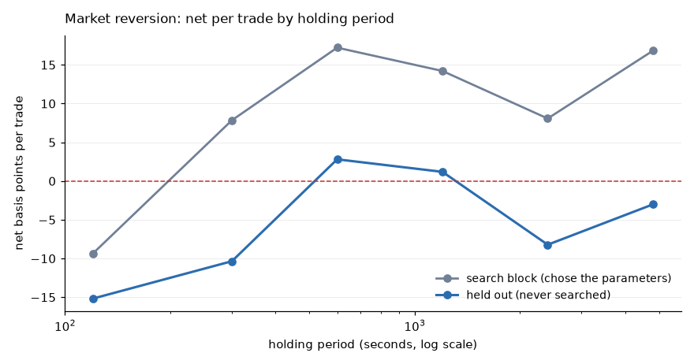

Both curves have the same shape — two minutes loses, ten minutes is best, longer
decays — and the held-out curve sits uniformly below the search one. Median over
520 configurations per point:

| Hold | Search block | Positive | Held out | Positive |
|---|---|---|---|---|
| 2 min | −9.4 | 17% | −15.2 | 1% |
| 5 min | +7.8 | 67% | −10.4 | 22% |
| **10 min** | **+17.2** | **76%** | **+2.8** | **55%** |
| 20 min | +14.2 | 70% | +1.2 | 51% |
| 40 min | +8.1 | 64% | −8.2 | 41% |
| 80 min | +16.8 | 66% | −3.0 | 47% |

At the best cell — ten-minute lookback, ten-minute hold, sixty trades a day —
twenty of twenty-six instruments are positive on the held-out block, median
+6.9 bp per trade on about 126 trades each. The ordering across instruments
follows the identity rather than the search: DOGEUSDT +26.7, APTUSDT +21.2,
UNIUSDT +19.7 at the top, BTCUSDT −5.1 and ETHUSDT −6.6 at the bottom. Volatile
alts have the dispersion to clear a cost that BTCUSDT, moving a fifth as far for
the same fee, does not.

### And then it died

Two kill conditions were written into [`findings.md`](findings.md) before the
test that would apply them: a median at or below zero across instruments, and a
holding-period profile that failed to repeat. The frozen configuration —
thresholds carried over from the original span, nothing re-tuned — was run on
12 March to 20 April 2024, which no part of the search, the parameter choice or
the model fitting had seen.

Both fired.

| Hold | Gross | Net | Instruments positive |
|---|---:|---:|---:|
| 2 min | +2.15 | −11.84 | 0 / 26 |
| 5 min | +1.27 | −13.21 | 0 / 26 |
| **10 min (frozen)** | **−5.31** | **−19.94** | **0 / 26** |
| 20 min | −15.47 | −29.62 | 0 / 26 |
| 40 min | −16.41 | −30.92 | 0 / 26 |

3,637 trades, −69,283 bp in total. The best instrument of twenty-six is DOGEUSDT
at −9.9 bp per trade, and it was the best of twenty-six on the original span too,
at +26.7.

The second condition fired harder than the first. A median below zero is what a
decayed edge looks like; an *inverted profile* is what an absent one looks like.
The best holding period is now the shortest tested rather than ten minutes, and
at the frozen horizon the **gross** edge has changed sign, from +16.6 bp to
−5.31 — before any cost is charged. The shape that repeated across the original
two blocks does not survive a third.

### What was worth recording anyway

The sixfold decay between the original blocks, written down as the main worry
while this was still a candidate, was the warning. It is the same signature §25
documented: a structure that looks like an interior optimum and is a period.

The gap test was worth running and was not the thing that failed. Whatever the
index return was measuring on the original span, it was not shared price noise —
the effect strengthened out to a thirty-second gap, which an accounting artefact
cannot do. It was a real property of February and early March, and not a
property of the market.

The configuration stays frozen in
[`strategies/reversion.py`](../src/trading_research/strategies/reversion.py) with
its result attached. A killed candidate kept in the open, with the number that
killed it, is worth more than a deleted one: the next person to find a
ten-minute reversion in crypto perpetuals can read what happened to this one.

---

## 28. Where the information is, and what a model can add to a rule

Two questions this project should have asked far earlier, in the right order.

### Which source carries anything

For most of this work the loop was: pick features, fit a model, look at the
money, try a different model. That answers "did this arrangement work" and never
answers "was there anything here to find", so every negative result was
ambiguous — the source may have been empty, or the model wrong for it.

[`evaluation/information.py`](../src/trading_research/evaluation/information.py)
inverts the order. Each block of features is measured *before* a model is
chosen: the linear ceiling it reaches on held-out data, its mutual information
with the sign of the move, and — the column that decides anything — what it adds
once the sources already accepted have had their say. A block correlating 0.05
alone contributes nothing if the existing features already span it.

On BICOUSDT at a two-minute horizon:

| Source | Columns | Alone | Incremental | Best single column |
|---|---|---:|---:|---|
| touch | 10 | 0.026 | 0.026 | queue_imbalance, 0.022 |
| depth | 13 | 0.016 | 0.016 | impact_imbalance_bp, 0.035 |
| cross-instrument | 21 | 0.011 | −0.017 | **index_return_120, 0.046** |
| flow (trade prints) | 11 | −0.009 | −0.005 | flow_imbalance_24, 0.021 |
| calendar (control) | 3 | −0.003 | −0.008 | weekday, 0.013 |

The calendar control scoring near zero is what makes the rest readable. The
finding is the third row: a *single* cross-sectional column reaches 0.046 out of
sample, twice the best column of the plane every earlier section used — and the
block's linear combination is worse than its own best column, which is a
statement about the fitting rather than the source. Following that one column is
what produced §27.

The audit also measured how good a forecast would need to be. Blending the
model's held-out predictions with the realised future at increasing weight
manufactures a forecast of known skill; running each through the same rule at
the same costs traces profit against skill. Net crosses zero at an information
coefficient of about **0.08 to 0.10**, identically at 5 and at 100 trades a day.
The best of everything tried reaches 0.023.

### What a model adds to a rule (that later turned out not to work)

The measurements below stand on their own as a comparison of arrangements, and
they were made before §27's candidate was killed. What they no longer establish
is that any of it makes money: a model that decides how far a losing trade will
run makes it lose less. The method is the part worth keeping.

The §27 rule enters on the index, holds for exactly ten minutes and stakes the
same amount every time. Decomposing its trades says which of those three costs
money:

| | Held-out block |
|---|---|
| Trades never in front | 11–15% |
| Given back from the peak | **51–86 bp** |
| Peak arrives at row | 63 of 120 |
| Still improving when the clock closed | 57% |
| A perfect exit would earn | +116.6 bp |
| The rule earns | +7.4 bp |

The entry is sound and the exit is not. So the model is not asked to replace the
rule — it is asked the questions the rule does not ask. This is meta-labelling:
the rule picks the side, the model decides what to do about it.

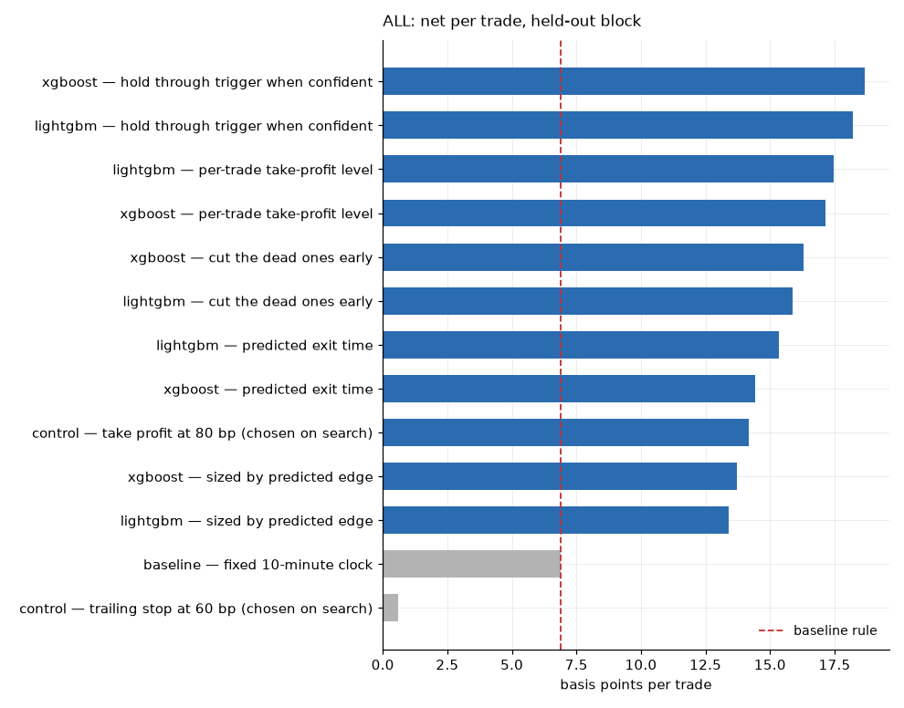

On 3,297 held-out trades across 26 instruments, models fitted on the search
block only. Comparisons are **paired** — the variants trade the same entries and
differ only in exit or size, so an unpaired test would call a real difference
noise:

| Variant | Net per trade | vs rule | paired t |
|---|---:|---:|---:|
| *oracle: perfect exit* | *+116.6* | *+109.2* | *48.0* |
| hold through the trigger when confident | **+18.8** | +11.4 | **10.0** |
| per-trade take-profit level | +17.2 | +9.8 | 8.5 |
| cut the dead ones early | +16.6 | +9.2 | 7.1 |
| predicted exit time | +15.5 | +8.1 | 4.8 |
| fixed take-profit, level chosen on search | +14.4 | +7.0 | 5.5 |
| sized by predicted edge | +14.0 | +6.6 | 4.5 |
| **baseline: fixed ten-minute clock** | **+7.4** | — | — |
| fixed trailing stop, level chosen on search | +1.2 | −6.2 | −5.3 |

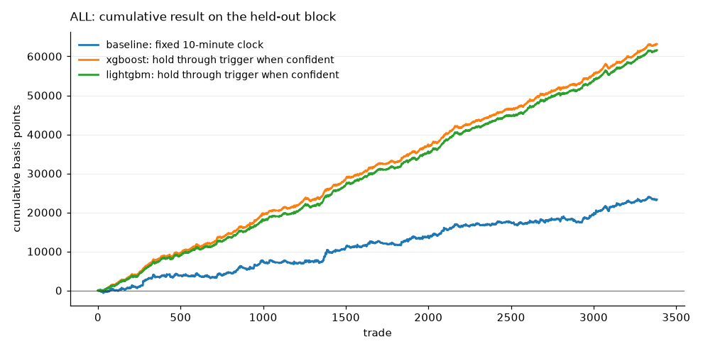

Every model variant beats the rule, both boosters agree closely, and the
arrangement that works best asks the model *how far a trade will run* and leaves
the decision to the rule. Asking the model to name the exit row outright is the
weakest of the six — the peak moves too much between trades to be predicted from
eight features.

### Two accounting errors that had to be fixed first

Neither is incidental; the first reversed the conclusion.

**A take-profit was booked at the wrong price.** Paths were stored on a
one-minute grid, so a trade that touched 80 bp and ran to 150 within the minute
was credited 150. A limit order fills at its price. Paths are now stored per row
and both the take-profit and the trailing stop book their trigger. On DOGEUSDT
this moved the fixed take-profit from +44.0 to +23.7 — from comfortably beating
every model to below the baseline — and what had looked like a simple rule
outperforming machine learning turned out to be the accounting.

**The sample was too small to see anything.** On DOGEUSDT alone, 113 trades, the
same ranking appears with a paired *t* of 1.19, which is nothing. The oracle
scores 10.94 on that same sample, so the test had the power and the sample did
not have the trades. The gap between 113 and 3,297 is the whole reason the
pooled figure is the one to read.

---

## 29. What would have to change

- **Book depth.** One level is observed here because that is all any exchange
  publishes for free. Level imbalance, book slope and concentration need a
  collector recording the stream forward in time.
- **Trade thinning.** Every signal is treated as an independent round trip. A
  real system imposes a cooldown and does not hold overlapping positions,
  which raises edge per trade at the cost of trade count.
- **Maker execution.** Measured in §11 rather than assumed: worth +2.3 to
  +5.0 bp per trade after the adverse selection it causes, which is more than
  the 0.37 bp §10 was short by. The caveats there are the work still to do —
  chiefly that adverse selection was measured at unconditional moments, not at
  the moments a model wants to trade.

Things that would **not** close it, on this evidence: a longer horizon, since
the edge is horizon-invariant (§3); more features, which measurably made it
worse (§4); trade thinning, which improves edge per trade but by about one basis
point (§5); trading only the most confident signals, which is selection rather
than edge (§6); and a better fee tier, which falls short by a factor of five
(§9).

Retraining frequency (§10) is the one lever that moved the number materially —
it closed all but 0.37 bp of a 12.68 bp gap on XRP — and it still did not close
it, nor did it survive being searched jointly with the holding period (§13). That it got as far as it did is the strongest argument for the two levers
above: a strategy this close to the line is one that maker execution or a real
volume tier could plausibly push across.

---

## Reading this

No result here is evidence that any strategy is or was profitable. These are
backtests computed with hindsight, over one period, in one regime, with
simplified execution — no queue position, no partial fills, no market impact,
no limit on concurrent exposure. Every one of those simplifications flatters the
result, and it is still negative.

See [`limitations.md`](limitations.md) and [`methodology.md`](methodology.md).
